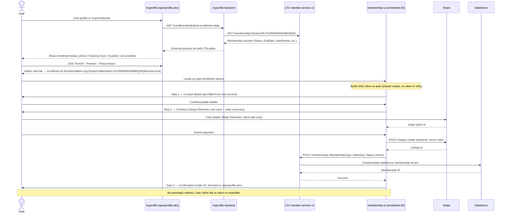
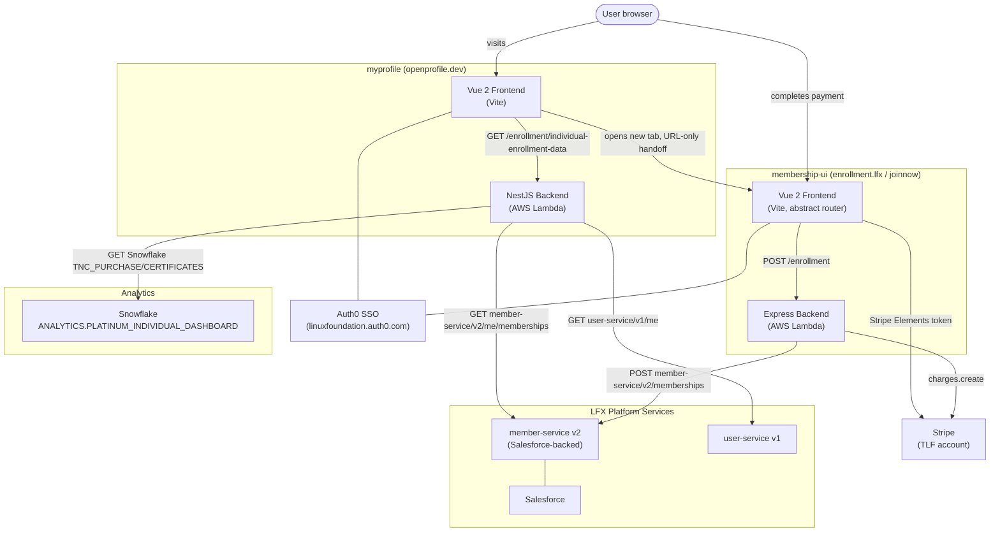

<!-- Copyright The Linux Foundation and each contributor to LFX. -->
<!-- SPDX-License-Identifier: MIT -->

# Individual Memberships — Current Flow & Migration Notes

> **Status:** Documents the current implementation (myprofile + membership-ui) and identifies
> what must be built in LFX Self Serve to migrate the experience.
> Audience: mixed engineering and product.

## At a Glance

The Linux Foundation offers a single paid individual tier today:

| Tier                       | Price    | Duration  | Notes                           |
| :------------------------- | :------- | :-------- | :------------------------------ |
| Individual Supporter (TLF) | $99/year | 12 months | Auto-renew supported via Stripe |

**Benefits** (per the [public landing page](https://www.linuxfoundation.org/about/individual-supporters)):

- $100 off any Linux Foundation certification exam
- Up to 10% off training courses
- 30% off one LF event registration per year
- Eligibility to purchase the $150 Lifetime Linux.com Email Alias add-on

The codebase also contains a commented-out RISC-V entry and a suppressed OpenJS Foundation
"Individual Participant" product (`ojsf`) which is discontinued, but neither is
surfaced to users today.

---

## User Journey

The journey crosses two applications: **myprofile** (`openprofile.dev`) manages
enrollment status and re-entry CTAs; **membership-ui** (`enrollment.lfx.linuxfoundation.org`)
handles the checkout wizard.



### Entry Points in myprofile

There are four surfaces where a user discovers or acts on their Individual Membership:

1. **Home dashboard (`/profile`)** — The `SupportedProjects` carousel shows a card for each
   enrolled product. Empty state links to a Jira support portal. Does not show upgrade CTAs.

2. **Individual Enrollments page (`/myenrollments`)** — Full list view with status chip
   ("Active" / "Expiring Soon" / "Expired"), AutoRenew toggle, price, benefits, and
   "Enroll" / "Renew My Enrollment" / "Repurchase" buttons.

3. **Side-menu "Individual Enrollments"** — Direct link to `/myenrollments`.

4. **Side-menu "Linux.com Email"** — Surfaces the email add-on, which requires an active
   Individual Supporter membership (see the [linux.com email forwarder doc](linux-com-email-forwarder.md)).

### Handoff URL

Myprofile builds the handoff URL in `joinnow.service.js`:

```text
Production:   https://enrollment.lfx.linuxfoundation.org/?project=tlf&product=01t2M000005wBb0QAE
Non-prod:     https://joinnow.<stage>.platform.linuxfoundation.org/?project=tlf&product=01t2M000005wBb0QAE
Renew:        above URL + &renew=true
```

**No user context is passed in the URL.** Authentication works because both apps share the
same Auth0 SSO tenant; when membership-ui detects no local session it calls
`loginWithRedirect()`, Auth0 fulfills the request silently via the existing SSO cookie,
and the query string is preserved through the redirect round-trip.

### Enrollment Wizard in membership-ui

The wizard is driven by `views/Enrollment.vue` and has three visual steps (not separate routes):

| Step             | Component                                               | What it does                                                             |
| :--------------- | :------------------------------------------------------ | :----------------------------------------------------------------------- |
| 1 — Contact      | `components/Enrollment-contact.vue`                     | Pre-fills name/address/phone from user-service; user can edit            |
| 2 — Checkout     | `components/Enrollment-checkout.vue` (+ sub-components) | Order summary, billing address, Stripe Elements card input, T&C checkbox |
| 3 — Confirmation | `components/Enrollment-confirmation.vue`                | Order number, link to openprofile.dev, CTA to add Linux.com email add-on |

### Return Path

After a successful enrollment there is **no automatic redirect**. The confirmation page
displays:

- A link to `openprofile.dev` (the myprofile prod URL, env-derived via `myprofile.service.js`).
- A "Purchase Linux.com Email Alias Add-On" button that re-enters membership-ui with the
  linux add-on product ID (see the linux.com email doc).

A cancel button in the wizard links to
`https://www.linuxfoundation.org/about/individual-supporters/`.

---

## Architecture



---

## Components & Files — myprofile

### Frontend

| File                                                                       | Role                                                                                                                                             |
| -------------------------------------------------------------------------- | ------------------------------------------------------------------------------------------------------------------------------------------------ |
| `frontend/src/router/index.js:20–23`                                       | Route `/profile` → `views/Home.vue`                                                                                                              |
| `frontend/src/router/index.js:116–119`                                     | Route `/myenrollments` → `components/block-enrollments/block-enrollments-list.vue`                                                               |
| `frontend/src/components/AppSideMenu/features.js:80–91`                    | Side-menu entries "Individual Enrollments" + "Linux.com Email"                                                                                   |
| `frontend/src/plugins/enrollment.plugin.js`                                | Global `$enrollment` plugin; owns all membership state; drives API calls; computes status labels (Active / Expiring Soon / Expired) from EndDate |
| `frontend/src/services/joinnow.service.js`                                 | Builds the handoff URL and exports `JOIN_URL` + `PURCHASE_LINUX_URL`; product IDs and joinnow base URL are **hardcoded** here (not env vars)     |
| `frontend/src/services/envState.service.js:1–30`                           | Derives `stage` (dev/test/staging/prod) from `VUE_APP_AUTH0_DOMAIN`; consumed by joinnow.service.js                                              |
| `frontend/src/components/block-enrollments/block-enrollments-list.vue`     | `/myenrollments` page — status, benefits, CTAs, AutoRenew toggle                                                                                 |
| `frontend/src/components/block-enrollments/block-enrollments.vue`          | Compact enrollment summary box (legacy dashboard layout)                                                                                         |
| `frontend/src/components/Profiles/SupportedProjects/SupportedProjects.vue` | "Supported Projects" carousel on Home; tooltip reads "Supported projects include individual annual memberships."                                 |
| `frontend/src/components/Profiles/SupportedProjects/SupportedItem.vue`     | Single project card; default title `'Individual Member'`                                                                                         |
| `frontend/src/data/pages-copies/index.js:34–40`                            | `INDIVIDUAL_ENROLLMENT` header copy rendered on the `/myenrollments` page                                                                        |
| `frontend/src/views/Home.vue:35, 147–148`                                  | Mounts SupportedProjects at top of authenticated Home dashboard                                                                                  |
| `frontend/src/views/Main.vue:593–594`                                      | Gating: newsletter sidebar shown only when `HasAccountLFMembership` is true (org membership flag, **not** individual)                            |

#### CTA code in block-enrollments-list.vue

```vue
<!-- Enroll (no membership yet) -->
<a v-if="!item.membership && !$user.inPreviewMode" :href="JOIN_URL + item.ctaPath" target="_blank">
  {{ item.enrollButton }}
</a>

<!-- Renew (expiring soon) -->
<a v-if="item.expireSoon" :href="JOIN_URL + item.ctaPath + '&renew=true'" target="_blank">
  Renew My Enrollment
</a>

<!-- Repurchase (expired) -->
<a v-else-if="item.isExpired" :href="JOIN_URL + item.ctaPath" target="_blank">
  Repurchase
</a>
```

#### Status derivation (enrollment.plugin.js:197–226)

The UI derives a display status from raw member-service data with these rules (in order):

1. No price + has membership → **Active** (free-tier projects)
2. `Status === 'Expired'` → **Expired**
3. `AutoRenew && ExtPaymentType === 'stripe'` → **Active**
4. `new Date(EndDate) < now` → **Expired**
5. `EndDate` within 30 days → **Expiring Soon**
6. Otherwise → **Active** / **Purchased**

`AutoRenew` and `ExtPaymentType` (derived from `ExtPaymentID.split(':')[0]`) are the only
fields from member-service that influence whether the "Manage AutoRenew" toggle is shown.

### Backend

| File                                                      | Role                                                                    |
| --------------------------------------------------------- | ----------------------------------------------------------------------- |
| `backend/src/modules/enrollment/enrollment.module.ts`     | NestJS module registration                                              |
| `backend/src/modules/enrollment/enrollment.controller.ts` | Controller for all `/enrollment/*` endpoints                            |
| `backend/src/modules/enrollment/enrollment.service.ts`    | Business logic: product catalog, alias management, member-service calls |
| `backend/src/modules/enrollment/dummy-data.ts`            | Mock data for demo user `johnlf2727`                                    |
| `backend/src/services/member.service.ts`                  | HTTP client to LFX `member-service` v2                                  |
| `backend/src/services/apigateway.service.ts`              | Builds LFX API Gateway base URL from `STAGE` env var                    |
| `backend/src/services/snowflake.service.ts`               | Snowflake query client for transactions/certs/trainings                 |

#### Backend API endpoints

| Method + Path                                      | Purpose                                                                                                                     |
| -------------------------------------------------- | --------------------------------------------------------------------------------------------------------------------------- |
| `GET /enrollment/individual-enrollment-data`       | Returns per-product enrollment status + CTA metadata; called by `$enrollment.GetDateForindividualEnrollment()` on page load |
| `PATCH /enrollment/individual-enrollment-data/:id` | Toggles AutoRenew; sets CancellationDate/Reason when disabling                                                              |
| `GET /enrollment/transactions`                     | Aggregated transaction history (events, training, certs, individual memberships); filterable by `?type=`                    |
| `GET /enrollment/profile-certifications`           | User certs from Snowflake                                                                                                   |
| `GET /enrollment/profile-trainings`                | User trainings from Snowflake                                                                                               |

#### Product catalog (enrollment.service.ts:214–304)

Product IDs are **identical across dev/staging/prod** in the current codebase:

| Project                      | Product                             | SFDC Product ID      |
| ---------------------------- | ----------------------------------- | -------------------- |
| The Linux Foundation         | Individual Supporter ($99/yr)       | `01t2M000005wBb0QAE` |
| Linux.com Email Alias add-on | Lifetime ($150)                     | `01t2M000005wBazQAE` |
| OpenJS Foundation            | Individual Participant (suppressed) | `01t2M000006sgfaQAA` |

---

## Components & Files — membership-ui

### membership-ui Frontend

| File                                                        | Role                                                                                                                   |
| ----------------------------------------------------------- | ---------------------------------------------------------------------------------------------------------------------- |
| `frontend/src/router/index.js:14–18`                        | Route `/individual-membership` → `views/Individual.vue` (free/application flow)                                        |
| `frontend/src/plugins/app.plugin.js:315–328`                | `GetPageToLoad()` — dispatches to `/enrollment` when `?product=…` is in URL                                            |
| `frontend/src/views/Enrollment.vue`                         | Paid enrollment wizard; manages `currentStep` state (1/2/3); orchestrates Stripe token + enrollment API call           |
| `frontend/src/components/Enrollment-contact.vue`            | Step 1 — contact details form                                                                                          |
| `frontend/src/components/Enrollment-checkout.vue`           | Step 2 — order summary + billing address + Stripe Elements                                                             |
| `frontend/src/components/stripe-elements.vue:55–138`        | Stripe Elements card input; calls `stripe.createToken()` client-side; emits `charge` event with `{ source: token.id }` |
| `frontend/src/components/Enrollment-confirmation.vue:6–139` | Step 3 — success confirmation; links to openprofile.dev; includes "Purchase Linux.com Email Alias" CTA                 |
| `frontend/src/components/Enrollment-confirmation-error.vue` | Error state shown when member-service fails after Stripe charge succeeds                                               |
| `frontend/src/services/stripe.service.js:7–17`              | Selects Stripe publishable key by project slug (TLF vs OJSF)                                                           |
| `frontend/src/services/myprofile.service.js:8–13`           | Builds `openprofile.dev` / `myprofile.<stage>.platform…` return URL                                                    |
| `frontend/src/services/enrollment.service.js:8–50`          | HTTP client for `GET /enrollment` and `POST /enrollment`                                                               |

#### Core wizard handler (Enrollment.vue:283–330)

```js
async onCharge(customer) {
  const payload = {
    projectSlug: this.$project.project.Slug,
    userinfo,
    email, userID, userFullName,
    productID: product,         // SFDC product ID from ?product= param
    source: customer.source,    // Stripe token id
    autoRenew: this.autoRenew,
    renew: this.forRenew        // true when &renew=true is in URL
  };
  const [err, enrollment] = await to(EnrollmentService.CreateEnrollment(payload));
  this.orderID = enrollment.ID;
  this.displayThanksPage();     // → currentStep = 3
}
```

### membership-ui Backend

| File                                         | Role                                                                                                   |
| -------------------------------------------- | ------------------------------------------------------------------------------------------------------ |
| `backend/app.js:97–123`                      | Express router — mounts all modules                                                                    |
| `backend/modules/enrollment/index.js`        | `POST /enrollment` handler — full Stripe + Salesforce orchestration                                    |
| `backend/modules/enrollment/data.js:282–426` | Product catalog (per-stage, though IDs are identical across stages)                                    |
| `backend/services/stripe.service.js:10–49`   | Stripe client: `customers.create` + `charges.create`; picks TLF vs OJSF Stripe account by project slug |
| `backend/services/member.service.js:47–53`   | `AddIndividualMembership` — POSTs to `member-service/v2/memberships`                                   |
| `backend/services/user.service.js`           | Updates user record (address, phone) after enrollment                                                  |

#### POST /enrollment orchestration (enrollment/index.js:159–268)

1. Validate request; fetch product details from `data.js` catalog.
2. Check for existing active membership (`GetMyIndividualMemberships`) — 409 if already active
   and not a renew.
3. If a paid product: `StripeService.Purchase()` → get `stripeResponseId`.
4. `user.service.UpdatePartialMeUser()` — propagate address/phone to user-service.
5. `member.service.AddIndividualMembership()` — POST to `member-service/v2/memberships` with:

   ```text
   ProductID, ProjectID, Name,
   ExtPaymentID: "stripe:<stripeResponseId>",
   EndDate, AnnualFullPrice, Price,
   ContactID, MembershipType: "Individual",
   Status: "Active", AutoRenew, ContactEmail
   ```

6. On success → return `{ ID: membershipId }`.
7. On member-service failure **after** Stripe already charged:
   `NotifiyMembershipServiceError()` → files a Jira ticket + sends SES
   "URGENT: Individual Enrollment" email to support for manual reconciliation.

---

## Data Model & Sources of Truth

Myprofile **does not store membership state locally**. It reads from LFX `member-service`
v2 on every request:

```text
member-service/v2/me/memberships
  → filtered by productID and MembershipType: "Individual"
  → sorted by PurchaseDate desc, taking latest
```

The shape used by the UI per product:

```json
{
  "Status": "Active | Purchased | Expired",
  "AutoRenew": true,
  "PurchaseDate": "2024-03-15",
  "EndDate": "2025-03-15",
  "Price": 99,
  "ID": "membership-uuid",
  "ExtPaymentType": "stripe"
}
```

`ExtPaymentType` is derived client-side: `ExtPaymentID.split(':')[0]`
(e.g. `ExtPaymentID = "stripe:ch_3abcXYZ..."` → `ExtPaymentType = "stripe"`).

**Important distinctions:**

- `HasAccountLFMembership` (from `user-service/v1/me?includeAccountMembershipCheck=true`)
  is about the user's **organization** being an LF organizational member. It gates the
  newsletter sidebar in Main.vue. It is **not** the individual membership flag.
- There is no Auth0 role granted by individual membership. Membership status is purely
  derived from member-service data on each page load.
- No "tier" enum exists in the code. The only active tier is the TLF `Individual Supporter`
  product (`01t2M000005wBb0QAE`).

---

## Config & Environment

### myprofile — frontend

| Env var                   | Where used              | Notes                    |
| ------------------------- | ----------------------- | ------------------------ |
| `VUE_APP_AUTH0_DOMAIN`    | `envState.service.js:5` | Drives stage detection   |
| `VUE_APP_API`             | `vite.config.js:38`     | myprofile backend URL    |
| `VUE_APP_API_GATEWAY`     | `vite.config.js:42`     | LFX API Gateway audience |
| `VUE_APP_AUTH0_CLIENT_ID` | Auth0 setup             | —                        |

**Hardcoded constants (not env vars)** in `joinnow.service.js`:

- Joinnow/enrollment base URL per stage
- All SFDC product IDs

### myprofile — backend

| Env var                         | Where used                 | Notes                                               |
| ------------------------------- | -------------------------- | --------------------------------------------------- |
| `STAGE`                         | `apigateway.service.ts:14` | `dev`/`staging`/`prod`; drives API Gateway base URL |
| `ITX_API`                       | `itx.service.ts:14`        | Linux.com forwarder service base URL                |
| `AUTH0_ITX_ADMIN_CLIENT`        | `itx.service.ts:17`        | M2M client for ITX auth                             |
| `AUTH0_ITX_ADMIN_CLIENT_SECRET` | `itx.service.ts:18`        | —                                                   |
| `ITX_OBFUSCATE_KEY`             | `itx.service.ts:23`        | Alias obfuscation                                   |
| `AUTH0_DOMAIN`                  | `apigateway.service.ts:27` | Auth0 domain                                        |
| `AUTH0_ADMIN_CLIENT`            | `apigateway.service.ts:28` | M2M client for member-service                       |
| `AUTH0_ADMIN_CLIENT_SECRET`     | `apigateway.service.ts:29` | —                                                   |

### membership-ui — frontend

| Env var                   | Where used                    |
| ------------------------- | ----------------------------- |
| `VUE_APP_AUTH0_DOMAIN`    | Auth0 SPA setup               |
| `VUE_APP_AUTH0_CLIENT_ID` | Auth0 SPA setup               |
| `VUE_APP_STRIPE_PK`       | Stripe publishable key (TLF)  |
| `VUE_APP_STRIPE_OJSF_PK`  | Stripe publishable key (OJSF) |

### membership-ui — backend

| Env var                                                  | Where used                       |
| -------------------------------------------------------- | -------------------------------- |
| `STRIPE_SK_KEY`                                          | TLF Stripe secret key            |
| `STRIPE_OJSF_SK_KEY`                                     | OJSF Stripe secret key           |
| `AUTH0_DOMAIN`, `AUTH0_CLIENT_ID`, `AUTH0_CLIENT_SECRET` | Lambda authorizer JWT validation |

---

## Failure Modes & Operational Notes

### Stripe-succeeded-but-member-service-failed

This is the most operationally sensitive failure path. If Stripe charges the card but the
subsequent `POST /memberships` to member-service fails:

1. `NotifiyMembershipServiceError()` auto-files a **Jira ticket** and sends an SES email
   with subject "URGENT: Individual Enrollment" to support (`backend/modules/enrollment/index.js:416–456`).
2. The user sees `Enrollment-confirmation-error.vue` and is directed to contact support.
3. Support must manually create the Salesforce record and reconcile with the Stripe charge.

There is **no automatic retry or idempotency key** for the member-service POST.

### Preview / impersonation

All enrollment CTAs are wrapped with `v-if="!$user.inPreviewMode"` in
`block-enrollments-list.vue:34, 92, 105`. LF staff who impersonate a user via
`x-for-id` / `x-for-username` headers cannot trigger enrollment actions.

### Demo user

Username `johnlf2727` returns hardcoded mock data from `dummy-data.ts` for all enrollment
endpoints. Used for demos and onboarding.

### Legacy / dead code

The following files exist in myprofile but are not reachable from any current route or
component import — candidates for cleanup:

- `frontend/src/components/mkThanksBlock.vue` — "Thank you for your Individual Membership
  application" page from an earlier era when the wizard was hosted inside myprofile.
- `frontend/src/components/mkTiersTable.vue` — Membership tier comparison table.
- `frontend/src/services/redirection.service.js` — Returns `/individual-membership` for
  `?type=individual` but no router entry exists and no caller invokes this method.
- `frontend/src/services/envState.service.js:61` — Feature flag `myIndividualEnrollments`
  is defined but never consumed anywhere.

---

## Migration Notes for LFX One

> This section is intentionally opinionated to help scope the migration project.

### What can be reused from the existing LFX One patterns

- **Module layout** — create `apps/lfx-one/src/app/modules/membership/` following the
  same pattern as `modules/profile/` (feature routes file, sub-folders for components,
  lazy-loaded entry in `app.routes.ts`).
- **Controller → Service tier** — new server routes at `src/server/routes/membership.route.ts`,
  controller at `controllers/membership.controller.ts`, service at
  `services/membership.service.ts`.
- **Shared DTOs** — add request/response interfaces to `packages/shared/src/interfaces/` so
  they're importable from both the Angular app and the SSR server.
- **`microservice-proxy.service.ts`** — already wires requests to the LFX v2 service layer.
  Membership read calls (`GET /memberships`) can follow the same pattern; **write calls
  will need a new authenticated path** (see gaps below).
- **`authMiddleware`** — all enrollment routes are protected; guard the Angular routes with
  `authGuard` and the Express routes with `requiresAuth()`.
- **Feature flags** — wrap the new enrollment surface behind an OpenFeature flag for staged
  rollout while both apps run in parallel.

### Gaps that must be addressed

| Gap                            | Detail                                                                                                                                                                                                                                                                             |
| ------------------------------ | ---------------------------------------------------------------------------------------------------------------------------------------------------------------------------------------------------------------------------------------------------------------------------------- |
| **No Stripe integration**      | LFX One has no payment processing today. A new Stripe server service and Angular checkout component must be built from scratch. The membership-ui `stripe-elements.vue` component can serve as a reference for the Stripe Elements pattern.                                        |
| **No Salesforce write path**   | LFX One currently reads Salesforce data via the LFX v2 service. The `POST /memberships` write to `member-service v2` is done server-side (as a backend-for-frontend call) but a new authenticated m2m token or a service account credential is needed — pattern doesn't exist yet. |
| **No order/cart domain**       | There is no checkout state model, price validation, or order ID tracking in LFX One. These need to be designed.                                                                                                                                                                    |
| **No enrollment form pattern** | Multi-step wizard with contact pre-fill, billing address, and payment step is a new interaction pattern for LFX One. Reference `Enrollment.vue` in membership-ui for the step flow, but rebuild in Angular with PrimeNG components.                                                |

### Open questions to resolve before implementation

1. **member-service v2 write target** — Should LFX One call `member-service v2` directly, or
   should there be a new BFF endpoint that wraps both Stripe and member-service (as
   membership-ui does today)?
2. **Single vs split Stripe accounts** — membership-ui maintains separate Stripe accounts for
   TLF vs OJSF. If OJSF Individual Participant is eventually re-enabled, the same split
   will be needed. If it stays TLF-only, a single Stripe account suffices.
3. **URL pattern** — `/join`, `/enroll/individual`, `/membership/join`? The new URL must be
   reachable from a CTA in myprofile (or LFX One's own dashboard) and from the public
   marketing page.
4. **Cutover strategy** — During the migration window, both the old membership-ui wizard and
   the new LFX One enrollment will exist. The `joinnow.service.js` handoff URL is hardcoded
   in myprofile; updating it will require a myprofile deployment.
5. **AutoRenew / subscription lifecycle** — Currently handled by PATCH to myprofile backend →
   member-service PATCH. Where does this UI live after migration?

---

## Appendix A — File Index

### myprofile

| File                                                                       | Notes                                                                                  |
| -------------------------------------------------------------------------- | -------------------------------------------------------------------------------------- |
| `frontend/src/router/index.js:20–23, 116–119, 186–199`                     | Routes for `/profile`, `/myenrollments`, `/edit/linux-email`, `/edit/email-management` |
| `frontend/src/services/joinnow.service.js`                                 | Handoff URL builder and product IDs                                                    |
| `frontend/src/services/envState.service.js:1–61`                           | Stage detection + unused feature flag                                                  |
| `frontend/src/plugins/enrollment.plugin.js`                                | Full enrollment state management                                                       |
| `frontend/src/components/AppSideMenu/features.js:80–91`                    | Side-menu entries                                                                      |
| `frontend/src/components/block-enrollments/block-enrollments-list.vue`     | Main `/myenrollments` page                                                             |
| `frontend/src/components/block-enrollments/block-enrollments.vue`          | Compact dashboard block                                                                |
| `frontend/src/components/Profiles/SupportedProjects/SupportedProjects.vue` | Home carousel                                                                          |
| `frontend/src/components/Profiles/SupportedProjects/SupportedItem.vue`     | Home carousel card                                                                     |
| `frontend/src/data/pages-copies/index.js:34–40`                            | Page header copy                                                                       |
| `frontend/src/views/Home.vue:35, 147–148`                                  | SupportedProjects mount                                                                |
| `backend/src/modules/enrollment/enrollment.controller.ts`                  | All `/enrollment/*` endpoints                                                          |
| `backend/src/modules/enrollment/enrollment.service.ts`                     | Business logic, product catalog                                                        |
| `backend/src/modules/enrollment/dummy-data.ts`                             | Mock data for demo user                                                                |
| `backend/src/services/member.service.ts`                                   | member-service v2 client                                                               |
| `backend/src/services/apigateway.service.ts`                               | LFX API Gateway URL builder                                                            |
| `backend/src/services/snowflake.service.ts`                                | Snowflake query client                                                                 |

### membership-ui

| File                                                        | Notes                                                           |
| ----------------------------------------------------------- | --------------------------------------------------------------- |
| `frontend/src/router/index.js:14–99`                        | All routes including `/enrollment` and `/individual-membership` |
| `frontend/src/plugins/app.plugin.js:315–328`                | Route dispatch logic                                            |
| `frontend/src/plugins/auth.plugin.js:46–126`                | Auth0 setup + silent re-auth on load                            |
| `frontend/src/views/Enrollment.vue:22–50, 188–330`          | Paid enrollment wizard                                          |
| `frontend/src/views/Individual.vue:439–549`                 | Free/application individual flow                                |
| `frontend/src/components/Enrollment-contact.vue`            | Step 1 component                                                |
| `frontend/src/components/Enrollment-checkout.vue`           | Step 2 component                                                |
| `frontend/src/components/stripe-elements.vue:55–138`        | Stripe Elements card input                                      |
| `frontend/src/components/Enrollment-confirmation.vue:6–139` | Step 3 confirmation                                             |
| `frontend/src/components/Enrollment-confirmation-error.vue` | Step 3 error state                                              |
| `frontend/src/services/stripe.service.js:7–17`              | Stripe PK selection                                             |
| `frontend/src/services/myprofile.service.js:8–13`           | openprofile.dev return URL                                      |
| `frontend/src/services/enrollment.service.js:8–50`          | Frontend HTTP client                                            |
| `backend/app.js:97–123`                                     | Express router                                                  |
| `backend/modules/enrollment/index.js:159–268`               | POST /enrollment handler                                        |
| `backend/modules/enrollment/data.js:282–426`                | Product catalog                                                 |
| `backend/services/stripe.service.js:22–49`                  | Stripe server-side charge                                       |
| `backend/services/member.service.js:47–53`                  | member-service AddIndividualMembership                          |
| `backend/serverless.yml:107–131`                            | Lambda authorizer wiring                                        |
| `frontend/serverless.yml:23–35`                             | Frontend deploy + prod alias                                    |

---

## Appendix B — Key Data Shapes

### GET /enrollment/individual-enrollment-data (myprofile backend)

Example response item (one entry per enrollable product):

```json
{
  "projectName": "The Linux Foundation",
  "projectSlug": "tlf",
  "ProductName": "Individual Supporter",
  "projectDesc": "Enroll as an Individual Supporter",
  "enrollButton": "Enroll",
  "price": 99,
  "projectLogo": "https://...",
  "benefits": ["$100 off certification exams", "..."],
  "projectId": "<sfdc-project-id>",
  "productSFID": "01t2M000005wBb0QAE",
  "productId": "01t2M000005wBb0QAE",
  "membership": {
    "Status": "Active",
    "AutoRenew": true,
    "PurchaseDate": "2024-03-15",
    "EndDate": "2025-03-15",
    "Price": 99,
    "ID": "<membership-uuid>",
    "ExtPaymentType": "stripe"
  },
  "ctaPath": "?product=01t2M000005wBb0QAE&project=tlf",
  "activeButtonText": "Active",
  "activeButtonURL": ""
}
```

If the user has no membership, `"membership"` is `null`.

### POST /enrollment (membership-ui backend)

Request body sent by `views/Enrollment.vue`:

```json
{
  "projectSlug": "tlf",
  "userinfo": { "address": "...", "phone": "..." },
  "email": "user@example.com",
  "userID": "<auth0-sub>",
  "userFullName": "Jane Smith",
  "productID": "01t2M000005wBb0QAE",
  "source": "tok_1AbcXyz...",
  "autoRenew": true,
  "renew": false
}
```

Success response:

```json
{ "ID": "<new-membership-uuid>" }
```
