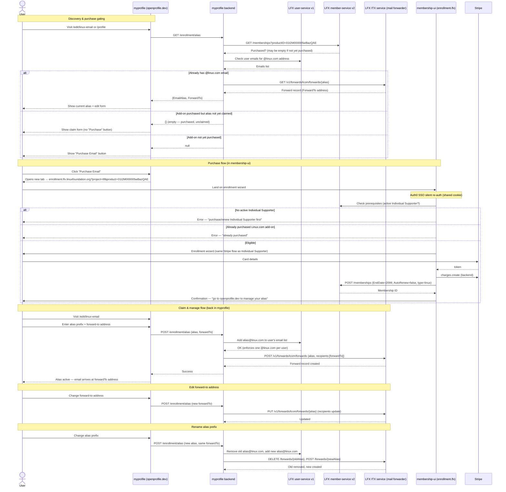
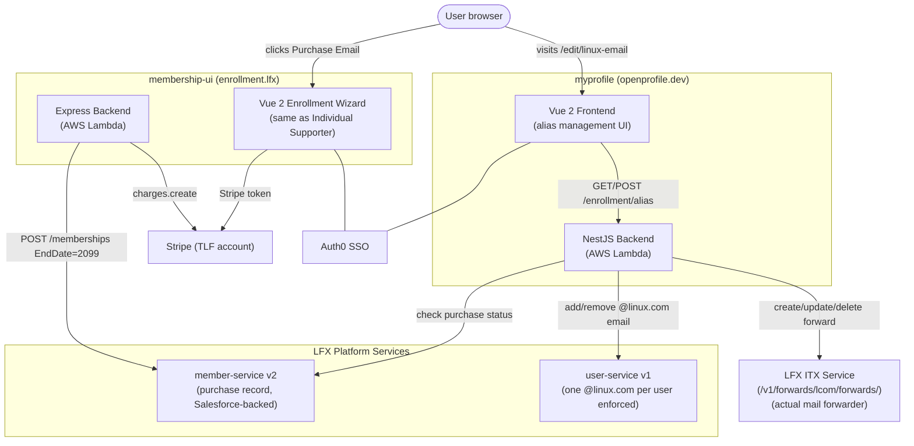

<!-- Copyright The Linux Foundation and each contributor to LFX. -->
<!-- SPDX-License-Identifier: MIT -->

# Linux.com Email Forwarder — Current Flow & Migration Notes

> **Status:** Documents the current implementation (myprofile + membership-ui) and identifies
> what must be built in LFX Self Serve to migrate the experience.
> Audience: mixed engineering and product.

## At a Glance

The **Lifetime Linux.com Email Alias Add-On** is a one-time purchase that grants an
authenticated Linux Foundation user a personal `<alias>@linux.com` address that forwards
email to a destination address of their choosing.

| Property        | Value                                                                 |
| --------------- | --------------------------------------------------------------------- |
| Price           | $150 (one-time, "lifetime")                                           |
| SFDC Product ID | `01t2M000005wBazQAE`                                                  |
| Prerequisite    | Active TLF Individual Supporter membership (`01t2M000005wBb0QAE`)     |
| Auto-renew      | Disabled; `EndDate` set to year 2099 to model "lifetime"              |
| Management      | Alias prefix + forward-to address managed in myprofile after purchase |

**Key characteristic of this flow:** the **purchase** and the **management** (claim/edit)
happen in two different applications today. This is the most obvious UX improvement the
LFX One migration can make — unifying both into one experience.

---

## User Journey



### Entry Points in myprofile

| Surface                       | Path                     | Component                                     |
| ----------------------------- | ------------------------ | --------------------------------------------- |
| Side-menu "Linux.com Email"   | `/edit/linux-email`      | `block-linux-alias/linux-email.vue`           |
| Linux.com alias summary block | `/profile` (Home)        | `block-linux-alias/block-linux-alias.vue`     |
| Email management edit page    | `/edit/email-management` | `block-linux-alias/email-management-edit.vue` |
| Main.vue quick-link           | `/profile`               | `views/Main.vue:412–416`                      |

The `block-linux-alias.vue` component shows either:

- A "Purchase Email" button (linking to membership-ui) when the add-on is not purchased.
- The current alias and a "Manage" button linking to `/edit/linux-email` when the add-on
  is purchased.

### Purchase Gating in membership-ui

Before rendering the enrollment wizard for the linux add-on product, the backend returns
HTTP 406 with one of three codes:

| Code                                        | Meaning                                            |
| ------------------------------------------- | -------------------------------------------------- |
| `enrollment_not_allowed_already_purchased`  | User already has an active linux add-on membership |
| `enrollment_not_allowed_individual_expired` | User had Individual Supporter but it has expired   |
| `enrollment_not_allowed_individual_needed`  | User has never purchased Individual Supporter      |

These are rendered by `frontend/src/components/Enrollment-linux-errors.vue` with
product-appropriate copy and a link back to the Individual Supporter enrollment.

---

## Architecture



Three distinct backend services are involved — `member-service`, `user-service`, and `ITX` — each with a separate responsibility. This is the main complexity to carry over in the migration.

---

## Components & Files — myprofile

### Frontend

| File                                                                  | Role                                                                                                                                                        |
| --------------------------------------------------------------------- | ----------------------------------------------------------------------------------------------------------------------------------------------------------- |
| `frontend/src/router/index.js:193–199`                                | Route `/edit/linux-email` → `linux-email.vue`                                                                                                               |
| `frontend/src/router/index.js:186–192`                                | Route `/edit/email-management` → `email-management-edit.vue`                                                                                                |
| `frontend/src/components/block-linux-alias/block-linux-alias.vue`     | Summary block on Home — shows status, links to `/edit/linux-email`; "Purchase Email" opens `PURCHASE_LINUX_URL` in new tab (`block-linux-alias.vue:72`)     |
| `frontend/src/components/block-linux-alias/linux-email.vue`           | Full claim/edit form — alias prefix field, forward-to field, FAQ link; `purchase()` method opens membership-ui                                              |
| `frontend/src/components/block-linux-alias/email-management-edit.vue` | Email Management page — wraps AlternativeEmails + calls `$enrollment.GetLinuxAlias()` on create                                                             |
| `frontend/src/plugins/enrollment.plugin.js`                           | `GetLinuxAlias()` (GET /enrollment/alias), `UpdateForward()` (POST /enrollment/alias), `linuxAlias` + `linuxForwardTo` + `linuxAliasEnabled` reactive state |
| `frontend/src/services/joinnow.service.js:20–23`                      | `PURCHASE_LINUX_URL` — prod: `https://enrollment.lfx.linuxfoundation.org/?project=tlf&product=01t2M000005wBazQAE`                                           |
| `frontend/src/views/Main.vue:412–416`                                 | Quick-link "Linux.com Email" in nav                                                                                                                         |

#### Purchase CTA (block-linux-alias.vue:72, linux-email.vue:155–157)

```js
purchase() {
  window.open(PURCHASE_LINUX_URL, '_blank');
}
```

The same pattern applies in `email-management-edit.vue:77`.

### Backend

| File                                                             | Role                                                                                                              |
| ---------------------------------------------------------------- | ----------------------------------------------------------------------------------------------------------------- |
| `backend/src/modules/enrollment/enrollment.controller.ts:30–126` | `GET /enrollment/alias` (purchase detection + forward lookup) and `POST /enrollment/alias` (create/update/rename) |
| `backend/src/modules/enrollment/enrollment.service.ts`           | `CreateForward`, `UpdateForwardRecipient`, `UpdateForwardAlias`, `CheckAliasAvailable`                            |
| `backend/src/services/itx.service.ts:205–252`                    | ITX HTTP client — GET/POST/PUT/DELETE `/v1/forwards/lcom/forwards/{alias}`                                        |
| `backend/src/services/user.service.ts:30–142`                    | `UpdateUserEmails` — add/remove `@linux.com` from the user's verified email list                                  |
| `backend/src/modules/user/user-emails/features.ts:42–48`         | `only_one_linux_email` error surfaced when user already has an `@linux.com` address                               |

#### GET /enrollment/alias detection logic (enrollment.controller.ts:30–74)

```text
1. Look for any @linux.com address in user.Emails.
   → If found: call ITX.GetForward('lcom', alias) → return {EmailAlias, ForwardTo}.

2. No @linux.com email found:
   → call MemberService.GetMyIndividualMemberships(productID: '01t2M000005wBazQAE').
   → If non-empty: return {} — "purchased but unclaimed". Frontend shows claim form.
   → If empty: return null — "not purchased". Frontend shows "Purchase Email" button.
```

#### POST /enrollment/alias routing logic (enrollment.controller.ts:76–126)

The same endpoint handles three cases by looking at the current state:

| Scenario                                        | Path                                                                                                                   |
| ----------------------------------------------- | ---------------------------------------------------------------------------------------------------------------------- |
| No existing `@linux.com` email                  | `EnrollmentService.CreateForward(alias, forwardTo)`                                                                    |
| Existing alias, only forward-to address changed | `EnrollmentService.UpdateForwardRecipient(alias, newForwardTo)`                                                        |
| Alias prefix changed                            | `EnrollmentService.UpdateForwardAlias(oldAlias, newAlias, forwardTo)` = delete + recreate on both user-service and ITX |

#### UpdateForwardAlias (enrollment.service.ts:126)

The rename operation is **not atomic**:

1. `userService.UpdateUserEmails(token, remove old alias)` — removes old email from user-service.
2. `itxService.DeleteForward('lcom', oldAlias)` — deletes old forward in ITX.
3. `userService.UpdateUserEmails(token, add new alias)` — adds new email to user-service.
4. `itxService.CreateForward('lcom', newAlias, recipient)` — creates new forward in ITX.

If step 3 or 4 fails, the user is left with their old alias deleted but the new one not
yet created. This is a known operational risk with the current implementation.

---

## Components & Files — membership-ui

The linux add-on **uses the same paid enrollment wizard** as the Individual Supporter
product — the only differences are which product ID is passed via `?product=` and a few
branches in the confirmation and error components.

| File                                                        | Role                                                                                                                                                   |
| ----------------------------------------------------------- | ------------------------------------------------------------------------------------------------------------------------------------------------------ |
| `frontend/src/components/Enrollment-linux-errors.vue`       | Error screen for 406 responses (not purchased Individual Supporter, or already purchased add-on)                                                       |
| `frontend/src/components/Enrollment-confirmation.vue:62–88` | Success confirmation for `type === 'linux'`; explicitly says "go to openprofile.dev to manage your email forwarding alias"                             |
| `backend/modules/enrollment/index.js:109–133`               | Purchase gating check — returns 406 with specific code before any Stripe attempt                                                                       |
| `backend/modules/enrollment/index.js:300–305, 369–374`      | Sets `EndDate` to year 2099 for the lifetime add-on; sets `AutoRenew = false`                                                                          |
| `backend/modules/enrollment/data.js:293–302`                | Product definition for `01t2M000005wBazQAE`: `{ type: 'linux', price: 150, required: '01t2M000005wBb0QAE', autoRenew: false, disableAutoRenew: true }` |

### "Lifetime" EndDate modeling (enrollment/index.js:300–305)

```js
if (productDetails.type === 'linux') {
  endDate = new Date('2099-01-01').toISOString();
} else {
  endDate = new Date(now.setFullYear(now.getFullYear() + 1)).toISOString();
}
```

#### Prerequisite check (enrollment/index.js:109–133)

```js
const existingLinux = await MemberService.GetMyIndividualMemberships(token, {
  productID: linuxProductID,
});
if (existingLinux?.length > 0) {
  return res.status(406).json({ code: 'enrollment_not_allowed_already_purchased' });
}
const activeIndividual = await MemberService.GetMyIndividualMemberships(token, {
  productID: individualProductID,
  status: 'Active',
});
if (!activeIndividual?.length) {
  const expiredIndividual = await MemberService.GetMyIndividualMemberships(token, {
    productID: individualProductID,
    status: 'Expired',
  });
  const code = expiredIndividual?.length ? 'enrollment_not_allowed_individual_expired' : 'enrollment_not_allowed_individual_needed';
  return res.status(406).json({ code });
}
```

---

## Data Model & State Derivation

The linux add-on's lifecycle in `member-service` differs from the annual Individual
Supporter because of the "lifetime" modeling:

| Field            | Individual Supporter      | Linux.com Add-On                 |
| ---------------- | ------------------------- | -------------------------------- |
| `EndDate`        | 1 year from purchase      | Year 2099                        |
| `AutoRenew`      | Optional (Stripe-managed) | Always false                     |
| `MembershipType` | `Individual`              | `Individual`                     |
| `Status`         | `Active / Expired`        | `Active` (effectively permanent) |
| `ExtPaymentID`   | `stripe:<chargeId>`       | `stripe:<chargeId>`              |

In `myprofile`, the "purchased" state is detected by the presence of a `member-service`
record for `productID = 01t2M000005wBazQAE`. The alias management state is then read from
**ITX** (not from member-service). The two services are independent:

```text
member-service  →  "did this user purchase the add-on?"
ITX             →  "what is their current alias and forward-to?"
user-service    →  "does this user have a @linux.com address in their email list?"
```

All three must be consistent for the feature to work correctly. They are not automatically
kept in sync — there is no saga or compensating transaction.

---

## Config & Environment

### myprofile — backend (ITX-specific)

| Env var                         | Where used          | Notes                      |
| ------------------------------- | ------------------- | -------------------------- |
| `ITX_API`                       | `itx.service.ts:14` | ITX service base URL       |
| `AUTH0_ITX_ADMIN_CLIENT`        | `itx.service.ts:17` | M2M client ID for ITX auth |
| `AUTH0_ITX_ADMIN_CLIENT_SECRET` | `itx.service.ts:18` | M2M client secret          |
| `ITX_OBFUSCATE_KEY`             | `itx.service.ts:23` | Alias obfuscation key      |

### myprofile — frontend

`PURCHASE_LINUX_URL` is **hardcoded** in `frontend/src/services/joinnow.service.js:20–23`.
It is not an env var. The linux product ID (`01t2M000005wBazQAE`) is the same across
all stages.

---

## Failure Modes

### Non-atomic alias rename

As noted in the backend section, renaming an alias is a four-step sequence with no rollback.
If any step fails mid-way, the user can end up with no active alias despite having a valid
purchase record. Support must manually reconcile.

### One @linux.com per user (user-service enforcement)

`user-service` enforces that each user account may have at most one `@linux.com` email
address. If a `POST /enrollment/alias` is attempted when the user somehow already has a
`@linux.com` address in user-service, it returns error code `only_one_linux_email`
(`backend/src/modules/user/user-emails/features.ts:42`). The frontend surfaces this as a
user-facing error on the alias form.

### Stripe-succeeded-but-member-service-failed

Same as the Individual Supporter flow — the same `NotifiyMembershipServiceError()` path
applies. A Jira ticket is filed automatically and support must manually create the
Salesforce record.

---

## Migration Notes for LFX One

> This section is intentionally opinionated to help scope the migration project.

### Opportunity: unify purchase and management in one app

Today the purchase wizard (membership-ui) ends with "go to a different app to activate
your alias." This is an awkward user experience. The LFX One migration is the right time
to close this gap: after a successful purchase, the user should be able to claim their
alias without leaving the same application.

### What can be reused from existing LFX One patterns

- **Module layout** — create `apps/lfx-one/src/app/modules/email-forwarder/` (or nest
  it under a `membership/` module alongside the Individual Supporter feature).
- **Auth middleware** — the ITX service uses an Auth0 M2M token; the same pattern used
  by other server-side service calls in LFX One applies.
- **Profile email page as a model** — `apps/lfx-one/src/app/modules/profile/email/`
  already handles profile email management (though backed by Supabase, not ITX). The
  form pattern and layout can be adapted.

### What needs to be built

| Item                                      | Detail                                                                                                                                                                                                                                                             |
| ----------------------------------------- | ------------------------------------------------------------------------------------------------------------------------------------------------------------------------------------------------------------------------------------------------------------------ |
| **ITX service client**                    | New server-side service at `apps/lfx-one/src/server/services/itx.service.ts`. Model after the existing `itx.service.ts` in myprofile backend — same Auth0 M2M token pattern, same ITX REST endpoints.                                                              |
| **member-service write for linux add-on** | Same gap as Individual Supporter (no write path today).                                                                                                                                                                                                            |
| **Alias claim/edit form**                 | Angular PrimeNG form component for alias prefix + forward-to. Straightforward; reference `linux-email.vue` in myprofile for the UX.                                                                                                                                |
| **Purchase prerequisite gating UI**       | Surface the 406 error codes from membership-ui as product-appropriate messages before or during the checkout step.                                                                                                                                                 |
| **Consistent state**                      | Three independent services hold pieces of this state today — `member-service` (purchase record), `ITX` (alias + forward-to), and `user-service` (@linux.com address) — and are not kept in sync. The migration must pick an explicit strategy: (a) accept eventual consistency and rely on user-initiated retry (current behavior; the "purchased but unclaimed" delay is the most visible symptom), (b) add a saga around purchase + alias-claim with compensating actions and robust error logging, or (c) add a periodic reconciler that compares the three sources and repairs or alerts on mismatches. |

### Open questions

1. **ITX API availability** — Is the ITX service stable and documented enough to call
   directly from LFX One, or does it need to be proxied through the LFX v2 service?
2. **Alias management in LFX One profile flow** — Should the `@linux.com` alias be
   treated as a special case of the existing profile email management
   (`modules/profile/email/`), or as a separate "Linux.com Email" feature under
   `modules/membership/`?
3. **Purchase UI location** — Should the linux add-on purchase live in the same checkout
   wizard as Individual Supporter (a step or upsell after confirming membership), or
   remain a separate product flow?

---

## Appendix — File Index

### myprofile

| File                                                                  | Notes                                                       |
| --------------------------------------------------------------------- | ----------------------------------------------------------- |
| `frontend/src/router/index.js:186–199`                                | Routes for `/edit/linux-email` and `/edit/email-management` |
| `frontend/src/services/joinnow.service.js:20–23`                      | `PURCHASE_LINUX_URL` (hardcoded)                            |
| `frontend/src/plugins/enrollment.plugin.js`                           | `GetLinuxAlias`, `UpdateForward`, reactive alias state      |
| `frontend/src/components/block-linux-alias/block-linux-alias.vue`     | Summary block with purchase/manage CTA                      |
| `frontend/src/components/block-linux-alias/linux-email.vue`           | Claim/edit alias form                                       |
| `frontend/src/components/block-linux-alias/email-management-edit.vue` | Email management wrapper                                    |
| `frontend/src/views/Main.vue:412–416`                                 | Quick-link nav entry                                        |
| `backend/src/modules/enrollment/enrollment.controller.ts:30–126`      | GET/POST /enrollment/alias endpoints                        |
| `backend/src/modules/enrollment/enrollment.service.ts`                | CreateForward / UpdateForwardRecipient / UpdateForwardAlias |
| `backend/src/services/itx.service.ts:205–252`                         | ITX HTTP client                                             |
| `backend/src/services/user.service.ts:30–142`                         | UpdateUserEmails (one @linux.com enforcement)               |
| `backend/src/modules/user/user-emails/features.ts:42–48`              | `only_one_linux_email` error code                           |

### membership-ui

| File                                                        | Notes                             |
| ----------------------------------------------------------- | --------------------------------- |
| `frontend/src/components/Enrollment-linux-errors.vue`       | Error screen for 406 responses    |
| `frontend/src/components/Enrollment-confirmation.vue:62–88` | Linux-specific confirmation copy  |
| `backend/modules/enrollment/index.js:109–133`               | Prerequisite gating (returns 406) |
| `backend/modules/enrollment/index.js:300–305`               | "Lifetime" EndDate = 2099 logic   |
| `backend/modules/enrollment/data.js:293–302`                | Linux add-on product definition   |

### Key data shape — GET /enrollment/alias responses

**Purchased and alias claimed:**

```json
{
  "EmailAlias": "jsmith@linux.com",
  "ForwardTo": "jane.smith@gmail.com"
}
```

**Purchased but alias not yet claimed:**

```json
{}
```

**Not purchased:**

```json
null
```
