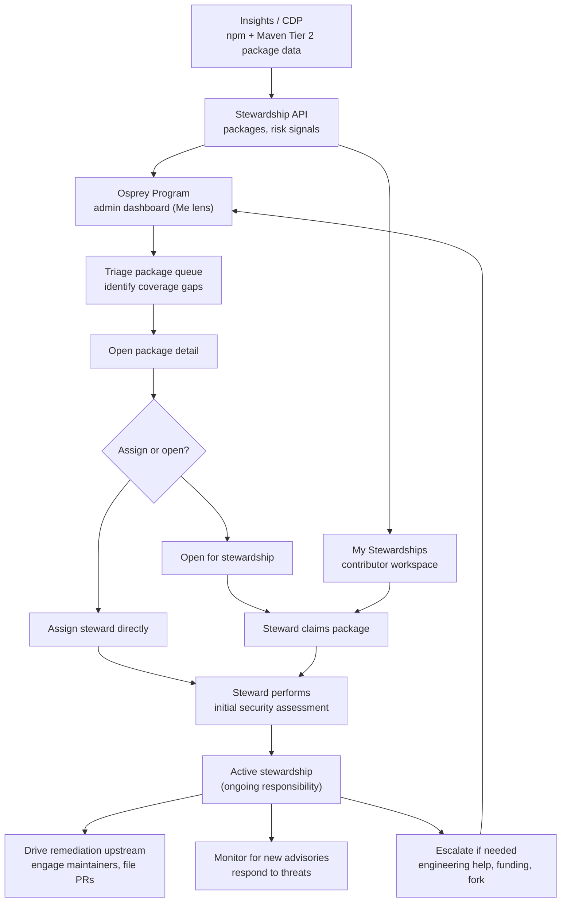
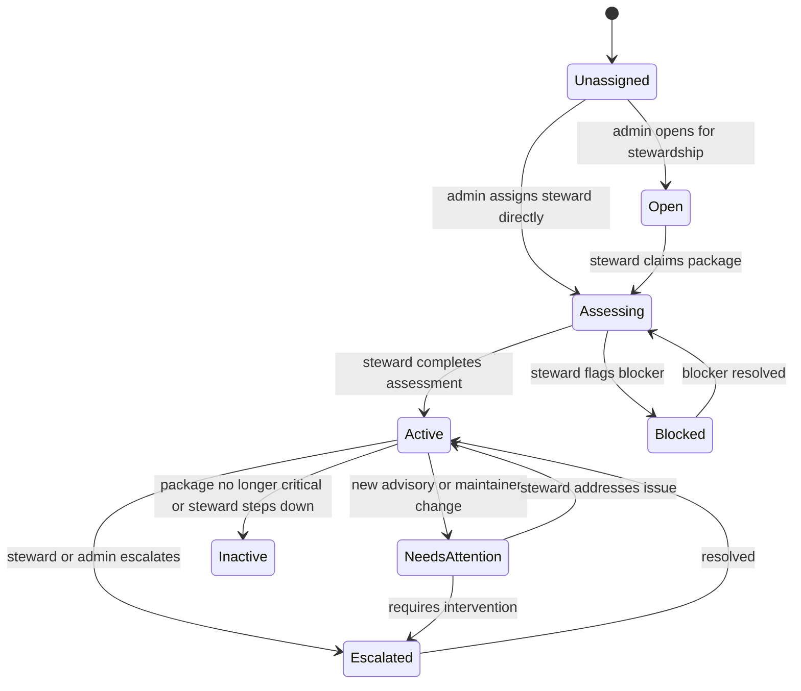

# Osprey Package Stewardship — Self Serve Integration

## Context

Project Osprey is an OpenSSF-coordinated effort to harden the world's most
critical open source packages before AI-assisted vulnerability discovery makes
them easy targets. The first phase covers npm and Maven Central.

Insights/CDP provides the data layer: package identity, risk signals,
maintainer info, repository mapping, and criticality scoring. Self Serve owns
the **stewardship workflow**: who is responsible for which packages, what is the
security posture of each package, what needs to be remediated, and what is the
ongoing status.

## What Stewardship Means

> **Stewardship is ongoing responsibility, not a one-time review.**
> A steward becomes the security point person for a critical package. They
> assess its security posture, drive remediation of gaps, engage with upstream
> maintainers, and monitor for new threats. Stewardship doesn't "complete" —
> it's active for as long as the package is critical.

A steward's work has two phases:

1. **Initial assessment** — evaluate the package's security posture across a
   standard framework, identify gaps, and create a remediation plan.
2. **Ongoing stewardship** — drive remediation, engage with maintainers,
   monitor for new threats, and escalate packages that need direct intervention
   (engineering help, funding, or forking).

## Actors

| Actor | Who | Responsibilities |
|-------|-----|------------------|
| **Osprey Admin** | OpenSSF staff coordinating the program | Triage the package queue, assign stewards, handle escalations, spot-check assessment quality, track coverage across the critical package set |
| **Steward** | Any authenticated LFX user | Claim packages, perform initial security assessment, drive remediation upstream, engage maintainers, monitor ongoing threats, escalate when needed |
| **Maintainer** *(v2)* | Verified upstream package maintainer | Submit their own package for stewardship, collaborate with steward on remediation, verify security contacts |

## Entry Points

### v1 (ship first)

| Lens | Tab | Who sees it | Purpose |
|------|-----|-------------|---------|
| **Me** | My Stewardships | Any authenticated user | Browse available packages, claim stewardship, manage your active stewardships. The contributor workspace. |
| **Me** | Osprey Program (admin only) | Osprey program admins | Admin dashboard: full package queue, coverage metrics, assignments, escalation management, spot-check quality. |

### v2 (deferred)

| Lens | Tab | Who sees it | Purpose |
|------|-----|-------------|---------|
| **Project** | Project Stewardship | Maintainers + anyone viewing the project | Maintainer submits their project for stewardship. Depends on registry API verification. |
| **Organization** | Organization Stewardships | Org members | Read-only visibility into stewardships involving the organization's members. |

## End-to-End Flow

## Stewardship Lifecycle

### Canonical Status Mapping

| Persisted state | UI label | Meaning |
|-----------------|----------|---------|
| `unassigned` | Unassigned | Package is critical but has no steward. The primary coverage gap. |
| `open` | Open | Package is available for a steward to claim. |
| `assessing` | Assessing | Steward is performing the initial security assessment. |
| `active` | Active | Steward is actively responsible for this package. The steady state. |
| `needs_attention` | Needs attention | New advisory, maintainer change, or other event requires steward response. |
| `escalated` | Escalated | Package needs intervention beyond the steward's scope: engineering help, funding, or a fork. |
| `blocked` | Blocked | Assessment cannot proceed (e.g., maintainer unresponsive, repo inaccessible). |
| `inactive` | Inactive | Package is no longer critical, steward stepped down, or stewardship is paused. |

The key difference from a task queue: **most packages should end up in `active`
and stay there.** "Active" is the success state, not a waypoint. The admin
dashboard's primary metric is coverage — what percentage of critical packages
have an active steward.

## Security Assessment Framework

The initial assessment is a structured evaluation of a package's security
posture, not a metadata verification checklist. The steward evaluates each
dimension, documents findings, and proposes a remediation plan for gaps.

### Assessment Dimensions

| Dimension | What the steward evaluates | Example findings |
|-----------|---------------------------|------------------|
| **Maintainer health** | Is anyone responsive? How fast would a critical CVE get patched? Bus factor? | "Single maintainer, last active 8 months ago." |
| **Security posture** | Vulnerability disclosure process? SECURITY.md? 2FA? Signed releases? | "No SECURITY.md. No disclosure process. Unsigned releases." |
| **Vulnerability exposure** | Open advisories? History of security issues? Known attack surface? | "4 historical CVEs, all patched. Prototype pollution surface." |
| **Dependency risk** | What does this package depend on? Are those dependencies healthy? | "12 direct deps, 2 unmaintained. Transitive dep on vulnerable minimist." |
| **Supply chain integrity** | Build reproducibility? Provenance attestation? Repo-to-artifact gap? | "Published artifact includes code not in the repo." |
| **Release health** | Release cadence? Stale? Deprecated? Active development? | "Last release 5 years ago. 200+ open issues. Active forks exist." |

### Assessment Output

The steward produces:

1. **Posture summary** — overall risk level (Critical / High / Medium / Low)
   with narrative justification.
2. **Findings** — specific gaps or risks, each with severity and evidence.
3. **Remediation plan** — concrete actions:
   - File upstream issues/PRs (e.g., add SECURITY.md, enable branch protection)
   - Engage maintainers (e.g., establish contact, propose disclosure process)
   - Escalate (e.g., recommend funding, engineering help, or fork)
4. **Monitoring plan** — what to watch for going forward.

The assessment is the steward's first act, not a gate. Completing the
assessment moves the steward directly to active stewardship — there is no
admin review bottleneck. Admins spot-check quality and can flag issues, but do
not gate every assessment. The assessment exists to structure the steward's
thinking and create an auditable record, not to create a queue for admin
approval.

## Steward Flow

### Phase 1: Claim & Assess

1. Steward opens Me → My Stewardships.
2. Browses available packages (ranked by criticality and coverage gaps).
3. Claims a package → moves to `assessing`.
4. Performs security assessment across the six dimensions.
5. Documents findings, posture summary, and remediation plan.
6. Completes assessment → moves directly to `active`.

### Phase 2: Active Stewardship (ongoing)

1. Steward is now the security point person for this package.
2. Executes remediation plan:
   - Files upstream issues and PRs for identified gaps
   - Engages maintainers on security improvements
   - Tracks remediation progress
3. Monitors for new threats:
   - New advisories trigger `needs_attention`
   - Maintainer changes, ownership transfers, repo archival
4. Escalates when needed:
   - Maintainer unresponsive after repeated outreach
   - Critical vulnerability with no path to upstream fix
   - Package needs engineering resources or funding
5. Updates stewardship status periodically (admin can set cadence).

## Admin Flow

The admin's primary concern is **coverage**: are the most critical packages
being stewarded? Secondary concern is **quality**: are stewards actually
driving remediation, not just documenting problems?

1. Osprey admin opens Me → Osprey Program.
2. Sees coverage metrics: total critical packages, active stewards, coverage
   percentage, unassigned critical packages, needs attention, escalated.
3. Identifies coverage gaps: which critical packages have no steward?
4. Opens packages for stewardship or assigns stewards directly.
5. Spot-checks assessment quality: flags incomplete or low-effort assessments
   for steward follow-up.
6. Handles escalations: allocate engineering resources, approve funding, decide
   on forks.
7. Monitors steward activity: are active stewards driving remediation or going
   quiet?
8. Uses bulk actions for high-volume queue management.

## Role and Action Matrix

| State | Steward | Osprey Admin |
|-------|---------|--------------|
| `unassigned` | View | Open for stewardship, assign steward, bulk assign |
| `open` | Claim package | Assign steward, close availability |
| `assessing` | Document findings, complete assessment, flag blocker | Reassign, flag blocker, spot-check |
| `active` | Update status, log remediation progress, escalate | Review activity, reassign, escalate |
| `needs_attention` | Investigate and respond, escalate if needed | Reassign, escalate |
| `escalated` | Provide context, continue monitoring | Allocate resources, approve funding, decide on fork, resolve |
| `blocked` | Add blocker details, resolve if able | Resolve, reassign |
| `inactive` | View history | Reactivate, reassign |

## Package Detail Drawer

### Tabs

- **Overview**: package identity, purl, ecosystem, criticality score,
  downloads, dependents, latest release, repository summary.
- **Assessment**: posture summary, findings by dimension, remediation plan,
  monitoring plan. For `active` packages: remediation progress and status
  updates.
- **Security**: OSV/GHSA advisories, critical vulnerability flag, security
  contact links, vulnerability policy links.
- **Provenance**: declared repository URL, normalized URL, mapping source,
  confidence level, build provenance status.

### History Timeline

Always visible below the active tab content. Includes: status changes,
assessment submissions, admin reviews, remediation actions logged, escalation
notes, advisory alerts, steward activity updates.

### Sticky Footer Actions

Context-dependent based on role and current state:

- Claim package / Assign steward
- Complete assessment
- Log remediation progress
- Escalate / Mark blocked
- Open in Insights

## Notifications (v1)

- In-app and email when a package is assigned to me.
- In-app and email when an admin flags my assessment for follow-up.
- In-app and email when a new advisory hits a package I steward.
- In-app and email when an escalation is resolved.
- Admin: when a steward completes an assessment (for spot-check queue).
- Admin: when a steward escalates a package.

Deferred to v2: admin digests, activity reminders for inactive stewards,
notification grouping.

## Permissions Model

| Role | How determined | Scope |
|------|----------------|-------|
| **Osprey Admin** | OpenSSF program-level admin role | All packages in the Osprey program |
| **Steward** | Any authenticated LFX user | Packages they've claimed or been assigned |
| **Maintainer** *(v2)* | Registry API verification (npm/Maven) | Their own packages |

## API Contract

Minimum API surface:

- `GET /api/stewardship/packages` — filters, cursor pagination, sort
- `GET /api/stewardship/packages/:id`
- `PATCH /api/stewardship/packages/:id` — admin overrides (repo mapping, etc.)
- `POST /api/stewardship/packages/:id/stewardships` — create stewardship
- `GET /api/stewardship/stewardships/:id` — stewardship detail
- `PATCH /api/stewardship/stewardships/:id` — update state, assessment, status
- `POST /api/stewardship/stewardships/:id/complete-assessment` — complete assessment, move to active
- `POST /api/stewardship/stewardships/:id/flag` — admin flags assessment for steward follow-up
- `POST /api/stewardship/stewardships/:id/escalate` — escalate
- `POST /api/stewardship/stewardships/:id/activity` — log remediation progress
- `GET /api/stewardship/my-work` — current user's stewardships
- `GET /api/stewardship/summary` — coverage metrics for dashboard

v2 additions:

- `GET /api/stewardship/org/:orgId/stewardships` — organization's stewardships
- `POST /api/stewardship/packages/:id/submit-for-stewardship` — maintainer
  submission entry point

No `DELETE` endpoints — all state transitions are patches that preserve history.

### Concurrency

Every stewardship mutation must include `state_version` for optimistic locking.
On conflict, the API returns the latest state so the UI can refresh.

## Design Direction

Dense operational layout consistent with existing LFX One dashboards. The admin
dashboard is **coverage-oriented**, not throughput-oriented — the primary
visualization is "how much of the critical package set is covered" rather than
"how many items were processed this week."

### Visual System

- Use existing Tailwind/LFX tokens only. No hard-coded hex values.
- Tags: `Unassigned` (neutral), `Open` (info), `Assessing` (warning),
  `Active` (success), `Needs attention` (danger),
  `Escalated` (danger), `Blocked` (danger), `Inactive` (neutral).
- Table is the primary surface. Row click opens the detail drawer.

## Data Pipeline Gap Analysis

### Covered by CDP Pipeline

- Package identity (name, ecosystem, purl)
- Downloads / dependents
- Latest version / release date
- Repo mapping
- OpenSSF Scorecard
- Advisories / critical vuln flag
- Repo stars, forks, last commit
- Maintainer info
- Licenses

### Gaps

| Gap | Priority | Detail |
|-----|----------|--------|
| Composite risk score | High | Raw signals exist but no composite tier. Primary sort/filter axis. |
| Repo mapping confidence | High | deps.dev has mapping but no confidence signal. |
| Security contact / policy | High | Critical for assessment. No SECURITY.md or contact data. |
| Build provenance | Medium | Supply chain assessment needs provenance attestation data. |
| Maintainer activity recency | Medium | Last commit collected but maintainer response time is not. |
| Package deprecation status | Medium | npm deprecation flags and Maven relocation. |
| Monorepo awareness | Medium | Need grouping to avoid duplicate stewardships. |

## Open Decisions

- **Which upstream service owns stewardship state?** Leaning: dedicated Osprey
  workflow service, with Insights/CDP as source-data providers.
- **Who computes composite risk scores?** CDP provides raw signals. Either CDP
  exposes pre-computed tiers, or the stewardship service computes them.
- **How does the package list sync from CDP?** Batch import, real-time feed, or
  API pull? Refresh cadence?
- **What triggers `needs_attention`?** New advisory is clear. What about
  maintainer account changes, repo archival, significant dependency changes?
- **How do we track remediation actions across external systems?** Log URLs
  only, or pull status from GitHub/registries?
- **What's the expected steward-to-package ratio?** One steward per package, or
  can a steward manage a cluster of related packages?
- **How often should active stewards report status?** Monthly? Quarterly?
  Event-triggered? Affects `inactive` detection.

## Suggested PR Sequence

1. Shared types + backend proxy/controller/service once upstream API contract is
   confirmed.
2. Admin package queue page (Me lens, admin-gated) with coverage metrics and
   filters/table/drawer in read-only mode.
3. Stewardship lifecycle: claim, assessment, activate.
4. My Stewardships (Me lens): contributor workspace with active stewardship
   management.
5. Activity logging: remediation progress, status updates, escalations.

## v2 Roadmap

Features explicitly deferred from v1:

- **Project Stewardship** (Project lens) — maintainer submission flow with
  registry API verification
- **Organization Stewardships** (Org lens) — read-only org-wide visibility
- Automated `needs_attention` triggers from advisory feeds
- Steward activity scoring / engagement metrics
- Remediation tracking with GitHub PR/issue status sync
- Assignment pool routing and round-robin
- Saved views (per-user, shareable)
- Notification digests and activity reminders
- Package clustering (steward manages related packages together)
