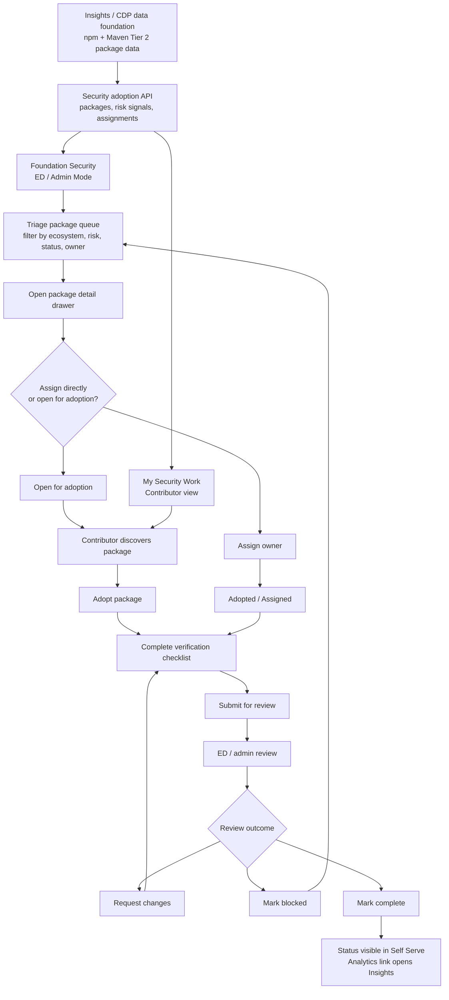
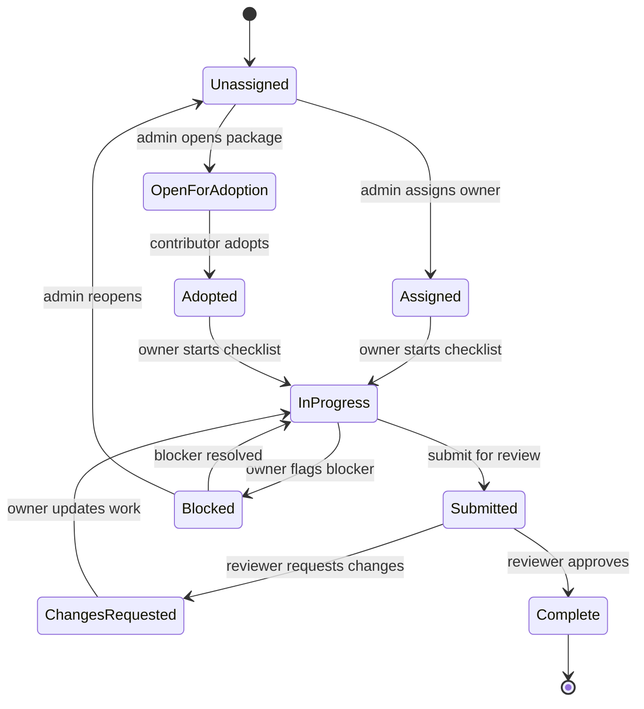

# Self Serve Security Project Adoption

## Context

The Osprey / Tier 2 npm + Maven work needs a Self Serve coordination layer. The
Slack direction was to build a tool that lets people "adopt a project" so the
review and hardening work can be split across a large set of dependencies.

Insights and CDP should remain the source-data and analytics layer. Self Serve
should own authentication, permissions, assignment, coordination, contributor
workflow, and review status.

## Product Surface

### Entry Points

- **Me lens:** `My Security Work`
  - Shows packages/projects I adopted, assigned work, due items, blocked items,
    and review status.
- **Foundation lens / Admin Mode:** `Security`
  - ED/admin coordination dashboard for the selected foundation or LF-wide
    Osprey program.
- **Project lens later:** `Security`
  - Package/repo security posture for a selected project once package-to-repo
    mapping confidence is reliable.

## End-to-End Flow



## State Model



## Admin Flow

1. ED/admin opens `Foundation -> Security`.
2. The page shows top metrics:
   - Critical packages
   - Unassigned
   - Adopted
   - Blocked
   - With critical advisory
   - Maintainer unknown / low-confidence repo mapping
3. ED/admin filters the work queue:
   - Ecosystem: npm, Maven
   - Status: unassigned, adopted, in review, complete, blocked
   - Risk: critical advisory, high dependents, single maintainer, stale repo
   - Source confidence: declared, deps.dev, heuristic, manual
4. ED/admin opens a package detail drawer.
5. ED/admin assigns an owner or marks the package open for adoption.
6. ED/admin tracks progress across adopters.
7. ED/admin links back to Insights for analytics-heavy views.

## Contributor Flow

1. User opens `Me -> My Security Work`.
2. User sees available packages to adopt plus assigned/adopted packages.
3. User opens a package drawer with:
   - Package identity
   - Ecosystem
   - Repository mapping
   - Downloads/dependents
   - Advisories
   - Maintainer/contact info
   - Suggested verification tasks
4. User clicks `Adopt`.
5. User completes the checklist:
   - Verify upstream repo
   - Verify maintainer/security contacts
   - Confirm latest version / release activity
   - Flag suspicious/stale metadata
   - Add notes
6. User submits for review.
7. ED/admin reviews, requests changes, or marks complete.

## Design Direction

Use a dense operational layout consistent with existing LFX One dashboards and
tables. This is not a marketing-style page.

### Page Header

- Title: `Security`
- Subtitle: `Coordinate critical package review and adoption across npm and Maven.`
- Primary admin action: `Create assignment`
- Secondary action: `Open in Insights`

### Stats Band

Use compact metric tiles via the existing stat-card patterns. Use neutral gray,
blue, amber, red, and emerald accents.

### Workspace

Filter row:

- Search input
- Ecosystem select
- Status tabs
- Risk filter
- Assignment filter

Main table columns:

- Package
- Ecosystem
- Criticality
- Downloads
- Dependents
- Repo
- Advisory
- Owner
- Status
- Updated

Row click opens a detail drawer.

### Package Drawer

Tabs:

- `Overview`
- `Adoption`
- `Security`
- `Provenance`
- `Activity`
- `Notes`

Sticky footer actions:

- `Adopt`
- `Assign`
- `Submit review`
- `Mark blocked`
- `Open in Insights`

## Codebase Fit

Relevant existing patterns:

- `apps/lfx-one/src/app/app.routes.ts` for flat routes under
  `MainLayoutComponent`.
- `apps/lfx-one/src/app/layouts/main-layout/main-layout.component.ts` for
  lens-aware sidebar entries.
- `apps/lfx-one/src/app/modules/dashboards/foundation-projects/` for dense
  operational table + filters + stats.
- `apps/lfx-one/src/app/modules/newsletters/` for list/create/detail patterns
  and ED-only feature routing.
- `apps/lfx-one/src/app/shared/components/table/`,
  `stat-card-grid/`, `filter-pills/`, `empty-state/`, `tag/`, and `button/`.

Suggested module:

```text
apps/lfx-one/src/app/modules/security/
├── security.routes.ts
├── security-work-dashboard/
├── security-admin-dashboard/
├── package-detail-drawer/
└── components/
```

Suggested routes:

- `/security` with `data: { lens: 'me' }`
- `/foundation/security` with `data: { lens: 'foundation' }`, ED/admin gated
- `/project/security` later, once package-to-repo confidence is ready for
  project context

## Backend/API Contract

Do not build the frontend against mock data. Minimum real API surface:

- `GET /api/security/packages`
  - filters, cursor pagination, sort
- `GET /api/security/packages/:id`
- `POST /api/security/packages/:id/adoptions`
- `PATCH /api/security/adoptions/:id`
- `POST /api/security/adoptions/:id/submit`
- `POST /api/security/adoptions/:id/review`
- `GET /api/security/my-work`
- `GET /api/security/summary`

Shared interfaces should live in:

```text
packages/shared/src/interfaces/security-adoption.interface.ts
```

## Suggested PR Sequence

1. Shared types + backend proxy/controller/service once upstream API contract is
   confirmed.
2. Admin package queue page with filters/table/drawer in read-only mode.
3. Adoption actions and `My Security Work`.
4. Review workflow, notes, blocked states, audit trail.
5. Project-lens package security view after package-to-repo confidence is high
   enough.

## Open Decisions

- Which upstream service owns the security adoption API: new Osprey/security
  service, Insights API, or an existing LFX service?
- Should this be LF-wide first or foundation-scoped first?
- What roles can assign/review adoption work beyond ED/admin?
- What fields should count as completion for npm vs Maven?
- Should Mythos be surfaced directly in the drawer or only linked out?
- How much of this is one-time Osprey workflow versus permanent Self Serve
  security surface?
