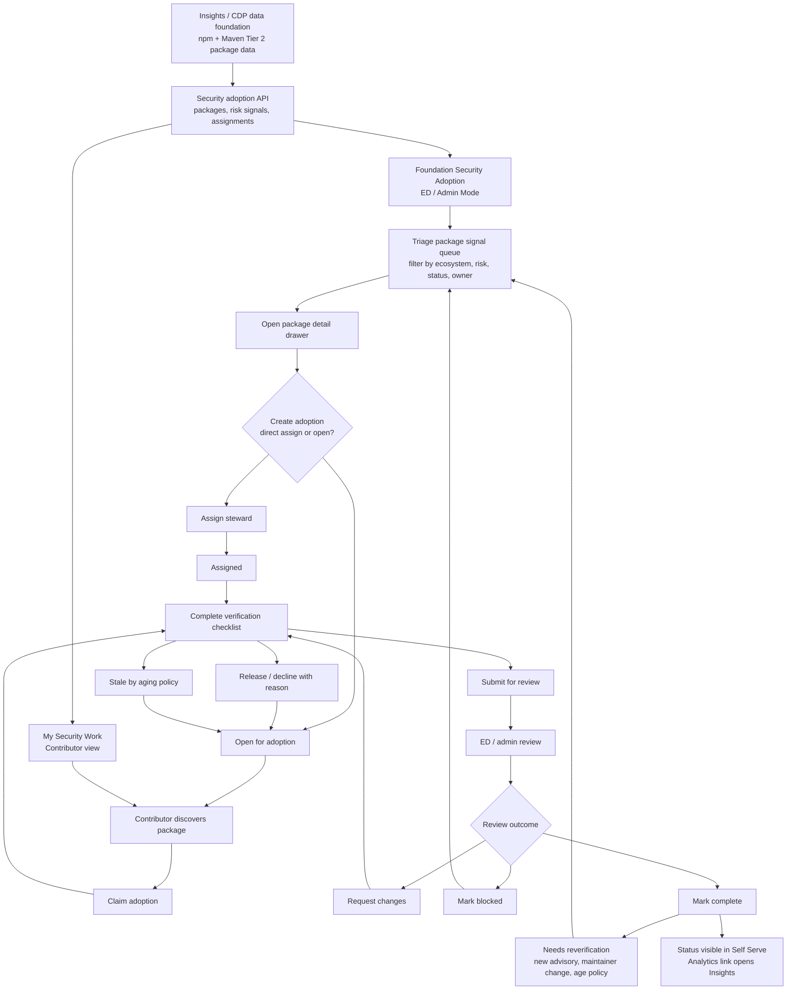
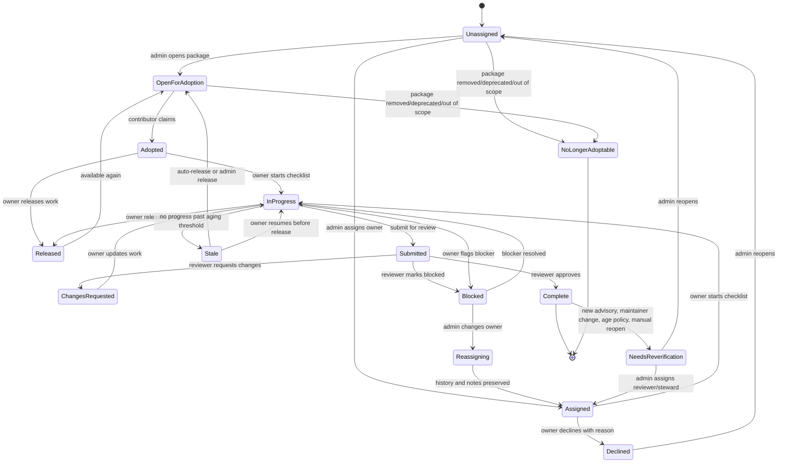

# Self Serve Security Project Adoption

## Context

The Osprey / Tier 2 npm + Maven work needs a Self Serve coordination layer. The
Slack direction was to build a tool that lets people "adopt a project" so the
review and hardening work can be split across a large set of dependencies.

Insights and CDP should remain the source-data and analytics layer. Self Serve
should own authentication, permissions, assignment, coordination, contributor
workflow, and review status.

## Product Surface

### Entry Points

- **Me lens:** `My Security Work`
  - Shows packages/projects I adopted, assigned work, due items, blocked items,
    and review status.
- **Foundation lens / Admin Mode:** `Security Adoption`
  - ED/admin coordination dashboard for the selected foundation or LF-wide
    Osprey program.
- **Project lens:** `Security`
  - Placeholder in v1 that links to the foundation queue filtered to known
    packages for the selected project, then becomes a full package/repo security
    posture view once package-to-repo mapping confidence is reliable.

## End-to-End Flow

The product flow is centered on **creating an adoption from a package security
signal**. A package signal can exist without an adoption. An adoption starts only
when an admin assigns a steward, opens the package for contributors, or a
contributor claims available work.



## State Model



### Canonical Status Mapping

Persisted API states should stay stable and machine-readable. UI labels can be
friendlier, but filters, tags, and transitions should map back to this canonical
set.

| Persisted state        | UI label                 | Meaning                                                                                          |
| ---------------------- | ------------------------ | ------------------------------------------------------------------------------------------------ |
| `unassigned`           | `Unassigned`             | Package is in the queue and has no owner.                                                        |
| `open_for_adoption`    | `Open` / `Available`     | Package is available for a contributor to adopt.                                                 |
| `assigned`             | `Assigned`               | Admin assigned an owner, but work has not started.                                               |
| `adopted`              | `Adopted`                | Contributor adopted the package, but work has not started.                                       |
| `in_progress`          | `In progress`            | Owner is actively working through the checklist.                                                 |
| `submitted`            | `In review`              | Owner submitted the checklist for ED/admin review.                                               |
| `changes_requested`    | `Changes requested`      | Reviewer sent the work back with required updates.                                               |
| `blocked`              | `Blocked`                | Work cannot proceed until the blocker is resolved.                                               |
| `stale`                | `Stale`                  | No checklist progress past the stale threshold.                                                  |
| `released`             | `Released`               | Owner released the adoption back to the open queue.                                              |
| `declined`             | `Declined`               | Assigned owner declined before starting, with a required reason.                                 |
| `reassigning`          | `Reassigning`            | Admin is changing owner while preserving prior work history.                                     |
| `complete`             | `Complete` / `Completed` | Reviewer approved the submission.                                                                |
| `needs_reverification` | `Needs reverification`   | Completed adoption was reopened by new advisory, maintainer change, age policy, or admin action. |
| `no_longer_adoptable`  | `No longer adoptable`    | Package is deprecated, transferred, removed, or out of scope.                                    |

The table filters should use persisted states in query params and request
payloads. Display-only labels such as `Available` or `Completed`
should be derived in the UI from the persisted state plus owner context.

`assigned` and `adopted` are behaviorally equivalent once work starts; both move
to `in_progress` on the first checklist update. Keep both states because the
provenance matters for reporting: admin-assigned work and contributor-claimed
work answer different coordination questions.

### Aging and Reverification Policy

- Warn owner after 30 days with no checklist progress.
- Move to `stale` after 45 days with no checklist progress.
- Release back to `open_for_adoption` after 60 days unless an admin overrides.
- Allow owners to self-release `adopted` or `in_progress` work with a required
  reason.
- Reopen `complete` as `needs_reverification` when a new advisory appears,
  maintainer/security contact changes, package ownership changes, package status
  changes, or an annual verification policy fires.
- Preserve adoption history, checklist evidence, comments, blocker reasons, and
  reviewer notes through reassignment and reverification.

## Admin Flow

1. ED/admin opens `Foundation -> Security Adoption`.
2. The page shows top metrics:
   - Total packages in scope
   - Unassigned percentage
   - Critical packages
   - In review
   - Blocked
   - Completed this week
3. ED/admin filters the work queue:
   - Ecosystem: supported ecosystems
   - Status: unassigned, open, assigned/adopted, in progress, in review,
     changes requested, blocked, stale, complete, needs reverification
   - Risk: critical advisory, high dependents, single maintainer, stale repo
   - Source confidence: declared, deps.dev, heuristic, manual
4. ED/admin opens a package detail drawer.
5. ED/admin creates an adoption by assigning a steward or marking the package
   open for adoption.
6. ED/admin tracks progress across adopters.
7. ED/admin uses bulk actions for high-volume queue management.
8. ED/admin links back to Insights for analytics-heavy views.

### Queue Scale and Bulk Operations

The queue can contain hundreds of thousands of packages, so the admin workflow
cannot assume one-row-at-a-time triage.

- Table supports multi-select across the current page and filtered result set.
- Bulk actions:
  - `Open for adoption`
  - `Assign steward`
  - `Reassign steward`
  - `Mark blocked`
  - `Apply tag`
  - `Release stale adoptions`
- Bulk actions above 500 rows run as async jobs with a progress drawer/toast and
  a downloadable result summary.
- Saved views are per-user and shareable by URL. Suggested defaults:
  - `Critical unassigned`
  - `npm owner unclear`
  - `Maven needs maintainer`
  - `Stale adoptions`
  - `Needs reverification`
- Server uses optimistic locking on adoption records. If a row changed after it
  was loaded, the UI shows conflict copy such as: `This package was just claimed
by {user}. Refresh to see the latest state.`

### Assignment Policies

Manual assignment ships first, but the data model should support routing rules
from the start.

- Named assignee pools per foundation or project.
- Optional round-robin assignment inside a pool.
- Optional rules:
  - auto-open packages matching critical-risk criteria
  - auto-assign packages with known project maintainers
  - require reviewer pool for high-criticality packages
- Rules should write normal adoption records so history, review, and analytics
  remain consistent with manually-created adoptions.

## Contributor Flow

1. User opens `Me -> My Security Work`.
2. User sees available packages to adopt plus assigned/adopted packages.
3. User opens a package drawer with:
   - Package identity
   - Ecosystem
   - Repository mapping
   - Downloads/dependents
   - Advisories
   - Maintainer/contact info
   - Suggested verification tasks
4. User clicks `Claim adoption` or accepts an admin assignment.
5. User completes the checklist:
   - Verify upstream repo
   - Verify maintainer/security contacts
   - Confirm latest version / release activity
   - Flag suspicious/stale metadata
   - Add notes
6. User submits for review.
7. User can release work back to the queue with a required reason if they are
   not the right steward or no longer have capacity.
8. ED/admin reviews, requests changes, or marks complete.

## Notifications

Minimum notification surface:

- In-app and email when work is assigned to me.
- In-app and email when someone claims work I opened.
- In-app and email when review is requested from me.
- In-app and email when my submission is approved, blocked, or has requested
  changes.
- In-app and email warning before stale auto-release.
- Admin digest for high-volume queue events, grouped by foundation, status, and
  saved view.
- Notification payloads should link directly to the package drawer in the
  correct lens/context.

## Role and Action Matrix

| State                  | Contributor / owner                                        | ED/admin / reviewer                                                                       |
| ---------------------- | ---------------------------------------------------------- | ----------------------------------------------------------------------------------------- |
| `unassigned`           | View                                                       | Create adoption, assign steward, open for adoption, bulk assign, mark no longer adoptable |
| `open_for_adoption`    | Claim adoption                                             | Assign steward, close availability, bulk assign                                           |
| `assigned`             | Accept/start, decline with reason                          | Reassign, release, mark blocked                                                           |
| `adopted`              | Start checklist, release                                   | Reassign, release, mark blocked                                                           |
| `declined`             | View reason, respond if reassigned                         | Reopen to unassigned, reassign, mark no longer adoptable                                  |
| `in_progress`          | Update checklist, submit for review, mark blocked, release | Reassign, mark blocked, request update                                                    |
| `submitted`            | View submission, reply to comments                         | Approve, request changes, mark blocked                                                    |
| `changes_requested`    | Update checklist, reply, resubmit, release                 | Reassign, mark blocked                                                                    |
| `blocked`              | Add blocker details, resolve if owner can                  | Resolve, reassign, release, mark no longer adoptable                                      |
| `released`             | View read-only history                                     | Reopen for adoption, assign steward, mark no longer adoptable                             |
| `stale`                | Resume before release, release                             | Release to open queue, reassign, extend due date                                          |
| `reassigning`          | View read-only history                                     | Finish reassignment, cancel reassignment, mark no longer adoptable                        |
| `complete`             | View history                                               | Reopen as needs reverification, open in Insights                                          |
| `needs_reverification` | Claim if open                                              | Assign steward, open for adoption, mark no longer adoptable                               |
| `no_longer_adoptable`  | View read-only history                                     | View read-only history, reopen only if package returns to scope                           |

Review notes:

- `Approve` allows an optional reviewer note.
- `Request changes` requires a note.
- `Mark blocked` requires a blocker reason.
- `Decline`, `Release`, and reassignment require a reason.

### Blocker Reasons

Use controlled categories plus optional free text:

- `awaiting_maintainer_response`
- `repo_mapping_unclear`
- `advisory_disputed`
- `package_deprecated_or_transferred`
- `out_of_scope_for_ecosystem`
- `owner_capacity`
- `other`

## Design Direction

Use a dense operational layout consistent with existing LFX One dashboards and
tables. This is not a marketing-style page.

### Page Header

- Title: `Security Adoption`
- Subtitle: `Coordinate critical package review and adoption across supported ecosystems.`
- Primary admin action: `Create adoption`
- Secondary action: `Open in Insights`

### Stats Band

Use compact metric tiles via the existing stat-card patterns. Lead with the two
numbers that explain scale, then show operational counts.

- Hero metrics:
  - Total packages in scope
  - Unassigned percentage
- Operational metrics:
  - Critical signals
  - In review
  - Stale
  - Blocked
  - Complete this week

Use neutral gray, blue, amber, red, and emerald accents. Each tile should show a
week-over-week delta when the upstream summary API supports it.

### Workspace

Filter row:

- Search input
- Ecosystem select
- Status tabs
- Risk filter
- Assignment filter

Main table columns:

- Package
- Ecosystem
- Risk
- Impact
- Repo confidence
- Advisory
- Owner
- Status
- Last activity

Row click opens a detail drawer.

`Risk` should render as a Critical / High / Medium / Low tag with numeric score
available on hover. `Impact` combines downloads and dependents to preserve scan
density. `Last activity` should summarize what changed, for example
`Status -> In review by A. User · 2h ago`.

### Package Drawer

Tabs:

- `Overview`
- `Adoption`
- `Security`
- `Provenance`
- `History`

Sticky footer actions:

- `Claim adoption`
- `Assign steward`
- `Submit review`
- `Mark blocked`
- `Open in Insights`

## Screen Designs

These designs map directly to existing Self Serve structure: left lens rail,
280px navigation panel, content inside the `MainLayoutComponent` outlet, compact
operational spacing, `lfx-table`, `lfx-stat-card-grid`, `lfx-filter-pills`,
`lfx-tag`, `lfx-button`, and drawer-based details.

### Foundation Security Adoption Queue

Purpose: ED/admin command center for the Osprey package queue.

```text
+------------------------------------------------------------------------------+
| Security Adoption                              [Create adoption] [Insights] |
| Coordinate critical package review and adoption across supported ecosystems. |
+------------------------------------------------------------------------------+
| [ Total in scope 600k ] [ Unassigned 69.7% ]                                  |
| [ Critical 1.8k ] [ In review 241 ] [ Stale 93 ] [ Complete this week 32 ]    |
+------------------------------------------------------------------------------+
| Saved: [Critical unassigned] [Needs maintainer] [Stale adoptions]            |
| [Signals] [Unassigned] [Open] [In progress] [In review] [Blocked] [Complete] |
|                                                                              |
| Search packages...     Ecosystem: All     Risk: All     Owner: All           |
+------------------------------------------------------------------------------+
| Package            Ecosystem  Risk      Impact        Repo   Owner   Status |
| lodash             npm        Critical  52.1M / 142k  High   --      Signal |
| org.slf4j:slf4j    Maven      Critical  -- / 81k      Med    Maya    Review |
| express            npm        High      31.4M / 72k   High   Lee     Stale  |
+------------------------------------------------------------------------------+
```

Design notes:

- Header is a compact page header, not a hero.
- Primary action appears only for users who can create adoptions.
- `Open in Insights` is secondary because analytics stays in Insights.
- Metrics are scan-first and should use understated status color:
  - critical advisory: red
  - blocked: amber
  - complete/adopted: emerald
  - neutral totals: gray/blue
- Table is the primary surface. No card-per-package view for desktop.
- Multi-select appears when the user has bulk permissions.
- Bulk actions run as async jobs when the affected row count exceeds the UI
  threshold.

### My Security Work

Purpose: contributor workspace for adopted and available work.

```text
+------------------------------------------------------------------------------+
| My Security Work                                                            |
| Review critical packages you adopted or were assigned.                       |
+------------------------------------------------------------------------------+
| [ Assigned to me 18 ] [ Due soon 4 ] [ In review 3 ] [ Blocked 1 ]          |
+------------------------------------------------------------------------------+
| [My work] [Available to adopt] [Completed]                                  |
|                                                                              |
| Search packages...     Foundation: All     Ecosystem: All     Risk: High    |
+------------------------------------------------------------------------------+
| Package       Foundation  Status       Checklist  Risk signal   Last activity|
| react         CNCF        In progress  3 / 6      High impact   Today        |
| minimist      OpenSSF     Blocked      2 / 6      Advisory      Yesterday    |
| jackson-core  OpenSSF     Available    --         Low maint.    May 25       |
+------------------------------------------------------------------------------+
```

Design notes:

- This route is task-first and should not require a foundation selector.
- Available packages should rank by criticality and readiness for adoption.
- Contributor actions are limited to `Claim adoption`, `Update checklist`,
  `Submit review`, `Mark blocked`, and `Release`.
- Include Foundation so cross-foundation work is legible.
- When opening a package drawer, show related peer activity such as
  `2 other open adoptions in this org` when applicable.

### Package Detail Drawer

Purpose: one place to inspect package data and act without leaving the queue.

```text
+----------------------------------------------+
| lodash                              [Close]  |
| pkg:npm/lodash     npm     Risk: Critical    |
+----------------------------------------------+
| [Overview] [Adoption] [Security] [Provenance]|
| [History 3 new]                              |
+----------------------------------------------+
| Overview                                     |
| Downloads last month        52.1M            |
| Dependent packages          142k             |
| Dependent repos             39k              |
| Latest version              4.17.21          |
| Latest release              2021-02-20       |
|                                              |
| Repository                                   |
| github.com/lodash/lodash                     |
| Source: deps.dev + declared URL              |
| Confidence: High                             |
+----------------------------------------------+
| [Claim adoption] [Assign steward] [Block]    |
| [Open in Insights]                           |
+----------------------------------------------+
```

Drawer tab content:

- `Overview`: identity, purl, ecosystem, namespace/name, registry URL,
  criticality score, downloads, dependents, latest release, repo summary.
- `Adoption`: current owner, status, checklist progress, reviewer, due date,
  assignment history.
- `Security`: OSV/GHSA advisories, critical vulnerability flag, security
  contact links, vulnerability policy links.
- `Provenance`: declared repository URL, normalized repository URL, mapping
  source, confidence, monorepo notes, manual override state.
- `History`: threaded comments, reviewer notes, contributor notes, blocked
  reason, audit trail, status changes, package/advisory updates, repo stars,
  last commit, OpenSSF Scorecard, release cadence, and maintainer
  responsiveness when available.

If the drawer has unread changes since the viewer last opened it, the `History`
tab shows a count pill such as `3 new`.

### Admin Review Drawer State

Purpose: review a submitted adoption without navigating away from the queue.

```text
+----------------------------------------------+
| Review submission                            |
| express               Submitted by A. User   |
+----------------------------------------------+
| Checklist                                    |
| [x] Upstream repo verified                   |
| [x] Maintainer/security contacts checked     |
| [x] Latest release confirmed                 |
| [x] Advisory data reviewed                   |
| [!] Repo mapping confidence is medium        |
|                                              |
| Contributor notes                            |
| The declared repository redirects to GitHub. |
| deps.dev maps to the same canonical repo.    |
+----------------------------------------------+
| [Request changes] [Mark blocked] [Approve]  |
+----------------------------------------------+
```

Design notes:

- Review actions should be explicit and mutually clear.
- `Approve` moves the item to `Complete`.
- `Request changes` requires a note.
- `Mark blocked` requires a reason and optional owner reassignment.
- `Approve` can include an optional note.
- Highest-criticality packages can require multiple reviewers when a foundation
  policy sets `required_reviewers > 1`.

## Responsive Behavior

- Desktop: table remains primary, filters in a single horizontal row where
  space allows, drawer opens from the right.
- Tablet: filters wrap to two rows; table remains horizontal with the existing
  `lfx-table` behavior.
- Mobile: metrics become a two-column grid; filters stack; table rows should
  collapse into compact rows with package name, ecosystem, status, and primary
  risk signal visible before opening the drawer.

## Visual System

- Use existing Tailwind/LFX tokens only; no hard-coded brand hex values.
- Prefer Font Awesome icons already used in the app:
  - `fa-shield` for Security
  - `fa-box` or `fa-cube` for Package
  - `fa-triangle-exclamation` for Risk / advisory
  - `fa-user-check` for Adopted
  - `fa-clock` for In review / due soon
  - `fa-ban` for Blocked
  - `fa-arrow-up-right-from-square` for Insights
- Tags:
  - `Unassigned`: neutral
  - `Open`: info
  - `Adopted`: info
  - `In progress`: warning
  - `In review`: warning
  - `Changes requested`: warning
  - `Stale`: warning
  - `Blocked`: danger
  - `Released`: neutral
  - `Declined`: neutral
  - `Needs reverification`: warning
  - `No longer adoptable`: neutral
  - `Complete`: success
- Keep cards at the existing 8px radius or less.
- Do not put UI cards inside other cards; repeated package rows belong in a
  table, not nested cards.

## Empty, Loading, and Error States

- No foundation selected:
  - Title: `Select a foundation to view security work`
  - Body: `Use the foundation selector in the sidebar to choose a foundation.`
- Empty queue:
  - Title: `No packages match these filters`
  - Body: `Clear filters or switch to all statuses.`
- No assigned work:
  - Title: `No security work assigned`
  - Body: `Browse available packages to adopt one when you're ready.`
- Error:
  - Title: `Failed to load security work`
  - CTA: `Retry`
- Loading:
  - Use existing table skeleton behavior with six to ten rows.

## Accessibility

- Status must not rely on color alone; every status appears as text in a tag.
- Package rows are keyboard reachable and open the drawer with Enter/Space.
- Drawer tabs use tablist semantics and preserve focus when switching tabs.
- Drawer close returns focus to the triggering table row.
- Review actions that require notes should focus the note field after selection.
- Drawer tab changes move focus to the first interactive element in the new tab.
- Sticky drawer footers use a single labeled `role="group"` landmark so screen
  readers announce the footer actions once on drawer open.
- Package queue keyboard shortcuts can support next/previous row navigation
  (`J` / `K`) after alignment with existing LFX table conventions.

## Codebase Fit

Relevant existing patterns:

- `apps/lfx-one/src/app/app.routes.ts` for flat routes under
  `MainLayoutComponent`.
- `apps/lfx-one/src/app/layouts/main-layout/main-layout.component.ts` for
  lens-aware sidebar entries.
- `apps/lfx-one/src/app/modules/dashboards/foundation-projects/` for dense
  operational table + filters + stats.
- `apps/lfx-one/src/app/modules/newsletters/` for list/create/detail patterns
  and ED-only feature routing.
- `apps/lfx-one/src/app/shared/components/table/`,
  `stat-card-grid/`, `filter-pills/`, `empty-state/`, `tag/`, and `button/`.

Suggested module:

```text
apps/lfx-one/src/app/modules/security/
|-- security.routes.ts
|-- security-work-dashboard/
|-- security-admin-dashboard/
|-- package-detail-drawer/
`-- components/
```

Suggested routes:

- `/security` with `data: { lens: 'me' }`
- `/foundation/security` with `data: { lens: 'foundation' }`, ED/admin gated
- `/project/security` placeholder initially, linking to the foundation security
  queue filtered to known packages for the selected project. The placeholder
  should explain that coverage improves as package-to-repo mapping confidence
  improves and should include an `Open in Insights` link.

## Backend/API Contract

Do not build the frontend against mock data. Minimum real API surface:

- `GET /api/security/packages`
  - filters, cursor pagination, sort
- `GET /api/security/packages/:id`
- `PATCH /api/security/packages/:id`
  - admin package-level overrides such as manual repo mapping corrections
- `POST /api/security/packages/:id/adoptions`
- `PATCH /api/security/adoptions/:id`
- `POST /api/security/adoptions/:id/submit`
- `POST /api/security/adoptions/:id/review`
- `GET /api/security/my-work`
  - cursor pagination matching `/api/security/packages`
- `GET /api/security/summary`
- `POST /api/security/bulk-jobs`
- `GET /api/security/bulk-jobs/:id`

Shared interfaces should live in:

```text
packages/shared/src/interfaces/security-adoption.interface.ts
```

### Example Adoption Record

```json
{
  "id": "adopt_123",
  "package_id": "pkg_npm_lodash",
  "scope": {
    "type": "foundation",
    "uid": "foundation_123",
    "name": "Cloud Native Computing Foundation"
  },
  "state": "in_progress",
  "state_version": 7,
  "origin": "admin_assigned",
  "owner": {
    "uid": "user_123",
    "name": "Maya Chen"
  },
  "reviewers": [
    {
      "uid": "user_456",
      "name": "ED Reviewer",
      "required": true,
      "approved_at": null
    }
  ],
  "required_reviewers": 1,
  "due_at": "2026-06-07T00:00:00Z",
  "checklist": [
    {
      "id": "repo_verified",
      "label": "Verify upstream repository",
      "state": "complete",
      "updated_at": "2026-05-25T18:30:00Z"
    },
    {
      "id": "security_contact",
      "label": "Confirm maintainer/security contact",
      "state": "incomplete",
      "updated_at": null
    }
  ],
  "blocker_reason": null,
  "history": [
    {
      "id": "event_123",
      "type": "state_changed",
      "actor_uid": "user_456",
      "from_state": "assigned",
      "to_state": "in_progress",
      "created_at": "2026-05-25T18:15:00Z"
    }
  ],
  "created_at": "2026-05-25T18:00:00Z",
  "updated_at": "2026-05-25T18:30:00Z"
}
```

### Concurrency

Every adoption mutation must include `state_version` or equivalent optimistic
locking metadata. On conflict, the API returns a typed conflict response with
the latest owner/state summary so the UI can refresh the row without guessing.

### Outbound Events

Self Serve should emit adoption lifecycle events for Insights and reporting even
if v1 only publishes them internally:

- `security_adoption.created`
- `security_adoption.state_changed`
- `security_adoption.review_requested`
- `security_adoption.review_completed`
- `security_adoption.blocked`
- `security_adoption.released`
- `security_adoption.needs_reverification`

Each event includes adoption id, package id, scope, previous state, next state,
actor, owner, reviewer, reason, and timestamp.

## Suggested PR Sequence

1. Shared types + backend proxy/controller/service once upstream API contract is
   confirmed.
2. Admin package queue page with filters/table/drawer in read-only mode.
3. Adoption actions and `My Security Work`.
4. Review workflow, notes, blocked states, audit trail.
5. Project-lens package security view after package-to-repo confidence is high
   enough.

## Open Decisions

- Which upstream service owns the security adoption API: new Osprey/security
  service, Insights API, or an existing LFX service?
  - Leaning: dedicated security/Osprey workflow service, with Insights/CDP as
    source-data providers, because adoption state is workflow data rather than
    analytics data.
- Should this be LF-wide first or foundation-scoped first?
  - Leaning: foundation-scoped first with an LF-wide admin aggregate, because
    review ownership, SLA, and assignment pools will differ by foundation.
- What roles can assign/review adoption work beyond ED/admin?
  - Leaning: ED/admin plus delegated security reviewers configured per
    foundation. Decision needed before API permission work starts.
- What fields should count as completion across ecosystems?
  - Leaning: shared checklist core plus ecosystem-specific checklist items.
    Avoid npm/Maven-only field names in shared routes and interfaces.
- Should Mythos be surfaced directly in the drawer or only linked out?
  - Leaning: link out from the drawer for v1 unless the upstream API provides a
    stable summary field. Self Serve should not become the analytics surface.
- How much of this is one-time Osprey workflow versus permanent Self Serve
  security surface?
  - Leaning: build permanent primitives (`package`, `adoption`, `review`,
    `history`) and let Osprey be the first program using them.

## Priority Updates From Spec Review

1. Resolve state lifecycle gaps before implementation: `needs_reverification`,
   `stale`, `released`, `declined`, `reassigning`, and `no_longer_adoptable`.
2. Design for real queue volume: bulk actions, saved views, assignment policies,
   async jobs, and optimistic locking.
3. Keep an explicit role x state x action matrix in the spec and QA plan.
4. Treat History as a first-class collaboration and audit surface, not a single
   notes textarea.
5. Keep copy and API fields ecosystem-agnostic so PyPI, RubyGems, Cargo, NuGet,
   and Go modules can join later without route or data-model churn.
