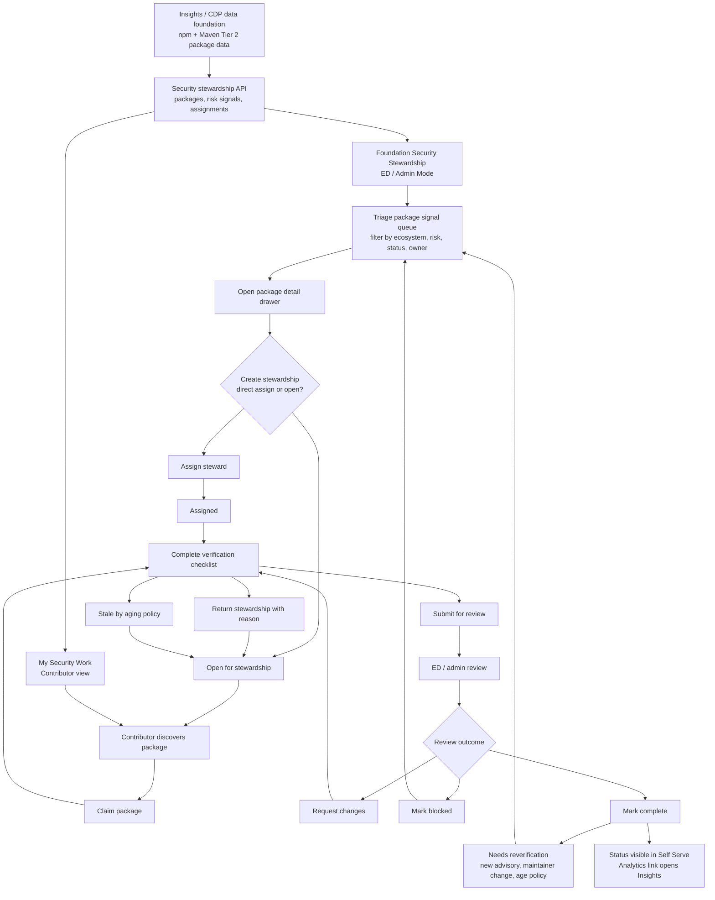
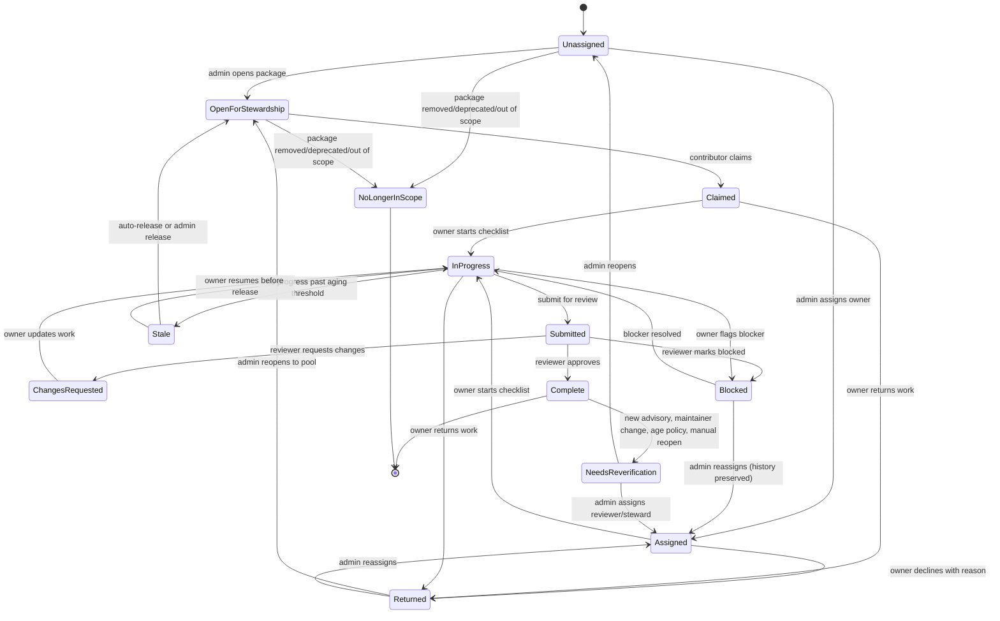

# Self Serve Security Package Stewardship

## Context

The Osprey / Tier 2 npm + Maven work needs a Self Serve coordination layer. The
Slack direction was to build a tool that lets people steward a package so the
review and hardening work can be split across a large set of dependencies.

Insights and CDP should remain the source-data and analytics layer. Self Serve
should own authentication, permissions, assignment, coordination, contributor
workflow, and review status.

## Product Surface

### Entry Points

- **Me lens:** `My Security Work`
  - Shows packages/projects I'm stewarding, assigned work, due items, blocked
    items, and review status.
- **Foundation lens / Admin Mode:** `Security Stewardship`
  - ED/admin coordination dashboard for the selected foundation or LF-wide
    Osprey program.
- **Project lens:** `Security`
  - Placeholder in v1 that links to the foundation queue filtered to known
    packages for the selected project, then becomes a full package/repo security
    posture view once package-to-repo mapping confidence is reliable.

## End-to-End Flow

The product flow is centered on **creating a stewardship record from a package
security signal**. A package signal can exist without a stewardship record.
Stewardship starts only when an admin assigns a steward, opens the package for
contributors, or a contributor claims available work.



## State Model



State simplifications vs. original:

- **`adopted` → `claimed`**: Avoids confusion with "technology adoption." Clearer
  intent: the contributor claimed responsibility.
- **`open_for_adoption` → `open_for_stewardship`**: Consistent rename.
- **`released` + `declined` → `returned`**: Both return work to the pool with a
  reason. Differentiate via `returned_reason` (`declined_before_start`,
  `released_during_work`, `capacity`, `not_the_right_steward`).
- **`reassigning` removed**: Reassignment is an admin action that atomically
  moves to `assigned` with a new owner and writes a history event — not a
  durable state. A transient "reassigning" state creates edge cases (admin
  abandons mid-reassignment) without clear benefit.
- **`no_longer_adoptable` → `no_longer_in_scope`**: Consistent rename.

### Canonical Status Mapping

Persisted API states should stay stable and machine-readable. UI labels can be
friendlier, but filters, tags, and transitions should map back to this canonical
set.

| Persisted state        | UI label                 | Meaning                                                                                             |
| ---------------------- | ------------------------ | --------------------------------------------------------------------------------------------------- |
| `unassigned`           | `Unassigned`             | Package is in the queue and has no owner.                                                           |
| `open_for_stewardship` | `Open` / `Available`     | Package is available for a contributor to claim.                                                    |
| `assigned`             | `Assigned`               | Admin assigned an owner, but work has not started.                                                  |
| `claimed`              | `Claimed`                | Contributor claimed the package, but work has not started.                                          |
| `in_progress`          | `In progress`            | Owner is actively working through the checklist.                                                    |
| `submitted`            | `In review`              | Owner submitted the checklist for ED/admin review.                                                  |
| `changes_requested`    | `Changes requested`      | Reviewer sent the work back with required updates.                                                  |
| `blocked`              | `Blocked`                | Work cannot proceed until the blocker is resolved.                                                  |
| `stale`                | `Stale`                  | No checklist progress past the stale threshold.                                                     |
| `returned`             | `Returned`               | Owner returned stewardship to the queue with a required reason.                                     |
| `complete`             | `Complete` / `Completed` | Reviewer approved the submission.                                                                   |
| `needs_reverification` | `Needs reverification`   | Completed stewardship was reopened by new advisory, maintainer change, age policy, or admin action. |
| `no_longer_in_scope`   | `No longer in scope`     | Package is deprecated, transferred, removed, or out of scope.                                       |

The table filters should use persisted states in query params and request
payloads. Display-only labels such as `Available` or `Completed`
should be derived in the UI from the persisted state plus owner context.

`assigned` and `claimed` are behaviorally equivalent once work starts; both move
to `in_progress` on the first checklist update. Keep both states because the
provenance matters for reporting: admin-assigned work and contributor-claimed
work answer different coordination questions. The stewardship record's `origin`
field (`admin_assigned` | `self_claimed`) preserves this distinction independent
of current state.

The `returned` state replaces the original `released` and `declined` states. The
reason for returning is captured in a `returned_reason` field with controlled
values: `declined_before_start`, `released_during_work`, `capacity`,
`not_the_right_steward`. This preserves the reporting signal without adding
extra states and transitions.

`returned` is a durable holding state that preserves why stewardship left a
person's queue. The package becomes available again only when an admin or system
policy reopens it to `open_for_stewardship`, or when an admin assigns a new
steward and moves it to `assigned`.

### Aging and Reverification Policy

Default thresholds (configurable per foundation):

- Warn owner after **30 days** with no checklist progress.
- Move to `stale` after **45 days** with no checklist progress.
- Auto-release stale work back to `open_for_stewardship` after **60 days** unless
  an admin overrides.

"Checklist progress" is defined as: any checklist item state change (incomplete
→ complete or vice versa), or a contributor note added to the stewardship
record. Opening the drawer or viewing the record does not count as progress.

Additional policies:

- Allow owners to self-return `claimed` or `in_progress` work with a required
  reason.
- Reopen `complete` as `needs_reverification` when a new advisory appears,
  maintainer/security contact changes, package ownership changes, package status
  changes, or an annual verification policy fires.
- Preserve stewardship history, checklist evidence, comments, blocker reasons,
  and reviewer notes through reassignment and reverification.

## Admin Flow

1. ED/admin opens `Foundation -> Security Stewardship`.
2. The page shows top metrics:
   - Total packages in scope
   - Unassigned percentage
   - Critical packages
   - In review
   - Blocked
   - Completed this week
3. ED/admin filters the work queue:
   - Ecosystem: supported ecosystems
   - Status: unassigned, open, assigned/claimed, in progress, in review,
     changes requested, blocked, stale, complete, needs reverification
   - Risk: critical advisory, high dependents, single maintainer, stale repo
   - Source confidence: declared, deps.dev, heuristic, manual
4. ED/admin opens a package detail drawer.
5. ED/admin creates a stewardship record by assigning a steward or marking the
   package open for stewardship.
6. ED/admin tracks progress across stewards.
7. ED/admin uses bulk actions for high-volume queue management.
8. ED/admin links back to Insights for analytics-heavy views.

### Queue Scale and Bulk Operations

The queue can contain hundreds of thousands of packages, so the admin workflow
cannot assume one-row-at-a-time triage.

- Table supports multi-select across the current page and filtered result set.
- Bulk actions:
  - `Open for stewardship`
  - `Assign steward`
  - `Reassign steward`
  - `Mark blocked`
  - `Apply tag`
  - `Auto-release stale stewardships`
- Bulk actions above a configurable row threshold run as async jobs with a
  progress drawer/toast and a downloadable result summary. The threshold should
  be determined during implementation based on actual API response times.
- Saved views are per-user and shareable by URL. Suggested defaults for v1:
  - `Critical unassigned`
  - `Stale stewardships`
  - `Needs reverification`
- Additional saved views can be added as the underlying data matures, including
  ecosystem-specific filters such as `npm owner unclear` or
  `Maven needs maintainer`.
- Server uses optimistic locking on stewardship records. If a row changed after
  it was loaded, the UI shows conflict copy such as: "This package was just
  claimed by {user}. Refresh to see the latest state."

### Assignment Policies

Manual assignment ships first, but the data model should support routing rules
from the start.

- Named assignee pools per foundation or project.
- Optional round-robin assignment inside a pool.
- Optional rules:
  - auto-open packages matching critical-risk criteria
  - auto-assign packages with known project maintainers
  - require reviewer pool for high-criticality packages
- Rules should write normal stewardship records so history, review, and
  analytics remain consistent with manually-created stewardships.

## Contributor Flow

1. User opens `Me -> My Security Work`.
2. User sees available packages to claim plus assigned/claimed packages.
3. User opens a package drawer with:
   - Package identity
   - Ecosystem
   - Repository mapping
   - Downloads/dependents
   - Advisories
   - Maintainer/contact info
   - Suggested verification tasks
4. User clicks `Claim package` or accepts an admin assignment.
5. User completes the checklist:
   - Verify upstream repo
   - Verify maintainer/security contacts
   - Confirm latest version / release activity
   - Flag suspicious/stale metadata
   - Add notes
6. User submits for review.
7. User can return work with a required reason if they are not the right steward
   or no longer have capacity.
8. ED/admin reviews, requests changes, or marks complete.

## Notifications

Minimum notification surface:

- In-app and email when work is assigned to me.
- In-app and email when someone claims a package I opened for stewardship.
- In-app and email when review is requested from me.
- In-app and email when my submission is approved, blocked, or has requested
  changes.
- In-app and email warning before stale auto-release.
- Admin digest for high-volume queue events, grouped by foundation, status, and
  saved view.
- Notification payloads should link directly to the package drawer in the
  correct lens/context.

## Role and Action Matrix

| State                  | Contributor / owner                                       | ED/admin / reviewer                                                                            |
| ---------------------- | --------------------------------------------------------- | ---------------------------------------------------------------------------------------------- |
| `unassigned`           | View                                                      | Create stewardship, assign steward, open for stewardship, bulk assign, mark no longer in scope |
| `open_for_stewardship` | Claim package                                             | Assign steward, close availability, bulk assign                                                |
| `assigned`             | Accept/start, return with reason                          | Reassign, return, mark blocked                                                                 |
| `claimed`              | Start checklist, return                                   | Reassign, return, mark blocked                                                                 |
| `in_progress`          | Update checklist, submit for review, mark blocked, return | Reassign, mark blocked, request update                                                         |
| `submitted`            | View submission, reply to comments                        | Approve, request changes, mark blocked                                                         |
| `changes_requested`    | Update checklist, reply, resubmit, return                 | Reassign, mark blocked                                                                         |
| `blocked`              | Add blocker details, resolve if owner can                 | Resolve, reassign, return, mark no longer in scope                                             |
| `returned`             | View read-only history                                    | Reopen for stewardship, assign steward, mark no longer in scope                                |
| `stale`                | Resume before auto-release, return                        | Auto-release to open queue, reassign, extend due date                                          |
| `complete`             | View history                                              | Reopen as needs reverification, open in Insights                                               |
| `needs_reverification` | Claim if open                                             | Assign steward, open for stewardship, mark no longer in scope                                  |
| `no_longer_in_scope`   | View read-only history                                    | View read-only history, reopen only if package returns to scope                                |

Review notes:

- `Approve` allows an optional reviewer note.
- `Request changes` requires a note.
- `Mark blocked` requires a blocker reason.
- `Return` and reassignment require a reason.

### Blocker Reasons

Use controlled categories plus optional free text:

- `awaiting_maintainer_response`
- `repo_mapping_unclear`
- `advisory_disputed`
- `package_deprecated_or_transferred`
- `out_of_scope_for_ecosystem`
- `owner_capacity`
- `other`

## Design Direction

Use a dense operational layout consistent with existing LFX One dashboards and
tables. This is not a marketing-style page.

### Page Header

- Title: `Security Stewardship`
- Subtitle: `Coordinate critical package review and stewardship across supported ecosystems.`
- Primary admin action: `Create stewardship`
- Secondary action: `Open in Insights`

### Stats Band

Use compact metric tiles via the existing stat-card patterns. Lead with the two
numbers that explain scale, then show operational counts.

- Hero metrics:
  - Total packages in scope
  - Unassigned percentage
- Operational metrics:
  - Critical signals
  - In review
  - Stale
  - Blocked
  - Complete this week

Use neutral gray, blue, amber, red, and emerald accents. Each tile should show a
week-over-week delta when the upstream summary API supports it.

### Workspace

Filter row:

- Search input
- Ecosystem select
- Status tabs
- Risk filter
- Assignment filter

Main table columns:

- Package
- Ecosystem
- Risk
- Impact
- Repo confidence
- Advisory
- Owner
- Status
- Last activity

Row click opens a detail drawer.

`Risk` should render as a Critical / High / Medium / Low tag with numeric score
available on hover. `Impact` combines downloads and dependents to preserve scan
density. `Last activity` should summarize what changed, for example
`Status -> In review by A. User · 2h ago`.

### Package Drawer

Tabs:

- `Overview`
- `Stewardship`
- `Security`
- `Provenance`

History should be a scrollable timeline at the bottom of the drawer (always
visible below the active tab content) rather than a separate tab. Reviewers
check history most often — hiding it behind a tab adds clicks in the most
common review workflow. The `3 new` unread indicator should appear as a
section header badge rather than a tab pill.

Sticky footer actions:

- `Claim package`
- `Assign steward`
- `Submit review`
- `Mark blocked`
- `Open in Insights`

## Screen Designs

These designs map directly to existing Self Serve structure: left lens rail,
280px navigation panel, content inside the `MainLayoutComponent` outlet, compact
operational spacing, `lfx-table`, `lfx-stat-card-grid`, `lfx-filter-pills`,
`lfx-tag`, `lfx-button`, and drawer-based details.

### Foundation Security Stewardship Queue

Purpose: ED/admin command center for the Osprey package queue.

```text
+------------------------------------------------------------------------------+
| Security Stewardship                        [Create stewardship] [Insights] |
| Coordinate critical package review and stewardship across supported          |
| ecosystems.                                                                  |
+------------------------------------------------------------------------------+
| [ Total in scope 600k ] [ Unassigned 69.7% ]                                  |
| [ Critical 1.8k ] [ In review 241 ] [ Stale 93 ] [ Complete this week 32 ]    |
+------------------------------------------------------------------------------+
| Saved: [Critical unassigned] [Needs maintainer] [Stale stewardships]         |
| [Signals] [Unassigned] [Open] [In progress] [In review] [Blocked] [Complete] |
|                                                                              |
| Search packages...     Ecosystem: All     Risk: All     Owner: All           |
+------------------------------------------------------------------------------+
| Package            Ecosystem  Risk      Impact        Repo   Owner   Status |
| lodash             npm        Critical  52.1M / 142k  High   --      Signal |
| org.slf4j:slf4j    Maven      Critical  -- / 81k      Med    Maya    Review |
| express            npm        High      31.4M / 72k   High   Lee     Stale  |
+------------------------------------------------------------------------------+
```

Design notes:

- Header is a compact page header, not a hero.
- Primary action appears only for users who can create stewardships.
- `Open in Insights` is secondary because analytics stays in Insights.
- Metrics are scan-first and should use understated status color:
  - critical advisory: red
  - blocked: amber
  - complete/claimed: emerald
  - neutral totals: gray/blue
- Table is the primary surface. No card-per-package view for desktop.
- Multi-select appears when the user has bulk permissions.
- Bulk actions run as async jobs when the affected row count exceeds the UI
  threshold.

### My Security Work

Purpose: contributor workspace for claimed and available work.

```text
+------------------------------------------------------------------------------+
| My Security Work                                                            |
| Review critical packages you're stewarding or were assigned.                 |
+------------------------------------------------------------------------------+
| [ Assigned to me 18 ] [ Due soon 4 ] [ In review 3 ] [ Blocked 1 ]          |
+------------------------------------------------------------------------------+
| [My work] [Available to claim] [Completed]                                  |
|                                                                              |
| Search packages...     Foundation: All     Ecosystem: All     Risk: High    |
+------------------------------------------------------------------------------+
| Package       Foundation  Status       Checklist  Risk signal   Last activity|
| react         CNCF        In progress  3 / 6      High impact   Today        |
| minimist      OpenSSF     Blocked      2 / 6      Advisory      Yesterday    |
| jackson-core  OpenSSF     Available    --         Low maint.    May 25       |
+------------------------------------------------------------------------------+
```

Design notes:

- This route is task-first and should not require a foundation selector.
- Available packages should rank by criticality and readiness for stewardship.
- Contributor actions are limited to `Claim package`, `Update checklist`,
  `Submit review`, `Mark blocked`, and `Return`.
- Include Foundation so cross-foundation work is legible.
- When opening a package drawer, show related peer activity such as
  `2 other open stewardships in this org` when applicable.

### Package Detail Drawer

Purpose: one place to inspect package data and act without leaving the queue.

```text
+----------------------------------------------+
| lodash                              [Close]  |
| pkg:npm/lodash     npm     Risk: Critical    |
+----------------------------------------------+
| [Overview] [Stewardship] [Security]          |
| [Provenance]                                 |
+----------------------------------------------+
| Overview                                     |
| Downloads last month        52.1M            |
| Dependent packages          142k             |
| Dependent repos             39k              |
| Latest version              4.17.21          |
| Latest release              2021-02-20       |
|                                              |
| Repository                                   |
| github.com/lodash/lodash                     |
| Source: deps.dev + declared URL              |
| Confidence: High                             |
+----------------------------------------------+
| [Claim package] [Assign steward] [Block]     |
| [Open in Insights]                           |
+----------------------------------------------+
```

Drawer tab content:

- `Overview`: identity, purl, ecosystem, namespace/name, registry URL,
  criticality score, downloads, dependents, latest release, repo summary.
- `Stewardship`: current owner, status, checklist progress, reviewer, due date,
  assignment history.
- `Security`: OSV/GHSA advisories, critical vulnerability flag, security
  contact links, vulnerability policy links.
- `Provenance`: declared repository URL, normalized repository URL, mapping
  source, confidence, monorepo notes, manual override state.

History timeline (always visible below active tab content): threaded comments,
reviewer notes, contributor notes, blocked reason, audit trail, status changes,
package/advisory updates, repo stars, last commit, OpenSSF Scorecard, release
cadence, and maintainer responsiveness when available.

If the drawer has unread changes since the viewer last opened it, the history
section header shows a count badge such as `3 new`.

### Admin Review Drawer State

Purpose: review a submitted stewardship without navigating away from the queue.

```text
+----------------------------------------------+
| Review submission                            |
| express               Submitted by A. User   |
+----------------------------------------------+
| Checklist                                    |
| [x] Upstream repo verified                   |
| [x] Maintainer/security contacts checked     |
| [x] Latest release confirmed                 |
| [x] Advisory data reviewed                   |
| [!] Repo mapping confidence is medium        |
|                                              |
| Contributor notes                            |
| The declared repository redirects to GitHub. |
| deps.dev maps to the same canonical repo.    |
+----------------------------------------------+
| [Request changes] [Mark blocked] [Approve]  |
+----------------------------------------------+
```

Design notes:

- Review actions should be explicit and mutually clear.
- `Approve` moves the item to `Complete`.
- `Request changes` requires a note.
- `Mark blocked` requires a reason and optional owner reassignment.
- `Approve` can include an optional note.
- Highest-criticality packages can require multiple reviewers when a foundation
  policy sets `required_reviewers > 1`.

## Responsive Behavior

- Desktop: table remains primary, filters in a single horizontal row where
  space allows, drawer opens from the right.
- Tablet: filters wrap to two rows; table remains horizontal with the existing
  `lfx-table` behavior.
- Mobile: metrics become a two-column grid; filters stack; table rows should
  collapse into compact rows with package name, ecosystem, status, and primary
  risk signal visible before opening the drawer.

## Visual System

- Use existing Tailwind/LFX tokens only; no hard-coded brand hex values.
- Prefer Font Awesome icons already used in the app:
  - `fa-shield` for Security
  - `fa-box` or `fa-cube` for Package
  - `fa-triangle-exclamation` for Risk / advisory
  - `fa-user-check` for Claimed / Steward
  - `fa-clock` for In review / due soon
  - `fa-ban` for Blocked
  - `fa-arrow-up-right-from-square` for Insights
- Tags:
  - `Unassigned`: neutral
  - `Open`: info
  - `Claimed`: info
  - `In progress`: warning
  - `In review`: warning
  - `Changes requested`: warning
  - `Stale`: warning
  - `Blocked`: danger
  - `Returned`: neutral
  - `Needs reverification`: warning
  - `No longer in scope`: neutral
  - `Complete`: success
- Keep cards at the existing 8px radius or less.
- Do not put UI cards inside other cards; repeated package rows belong in a
  table, not nested cards.

## Empty, Loading, and Error States

- No foundation selected:
  - Title: `Select a foundation to view security work`
  - Body: `Use the foundation selector in the sidebar to choose a foundation.`
- Empty queue:
  - Title: `No packages match these filters`
  - Body: `Clear filters or switch to all statuses.`
- No assigned work:
  - Title: `No security work assigned`
  - Body: `Browse available packages to claim one when you're ready.`
- Error:
  - Title: `Failed to load security work`
  - CTA: `Retry`
- Loading:
  - Use existing table skeleton behavior with six to ten rows.

## Accessibility

- Status must not rely on color alone; every status appears as text in a tag.
- Package rows are keyboard reachable and open the drawer with Enter/Space.
- Drawer tabs use tablist semantics and preserve focus when switching tabs.
- Drawer close returns focus to the triggering table row.
- Review actions that require notes should focus the note field after selection.
- Drawer tab changes move focus to the first interactive element in the new tab.
- Sticky drawer footers use a single labeled `role="group"` landmark so screen
  readers announce the footer actions once on drawer open.
- Package queue keyboard shortcuts can support next/previous row navigation
  (`J` / `K`) after alignment with existing LFX table conventions.

## Codebase Fit

Relevant existing patterns:

- `apps/lfx-one/src/app/app.routes.ts` for flat routes under
  `MainLayoutComponent`.
- `apps/lfx-one/src/app/layouts/main-layout/main-layout.component.ts` for
  lens-aware sidebar entries.
- `apps/lfx-one/src/app/modules/dashboards/foundation-projects/` for dense
  operational table + filters + stats.
- `apps/lfx-one/src/app/modules/newsletters/` for list/create/detail patterns
  and ED-only feature routing.
- `apps/lfx-one/src/app/shared/components/table/`,
  `stat-card-grid/`, `filter-pills/`, `empty-state/`, `tag/`, and `button/`.

Suggested module:

```text
apps/lfx-one/src/app/modules/security/
|-- security.routes.ts
|-- security-work-dashboard/
|-- security-admin-dashboard/
|-- package-detail-drawer/
`-- components/
```

Suggested routes:

- `/security` with `data: { lens: 'me' }`
- `/foundation/security` with `data: { lens: 'foundation' }`, ED/admin gated
- `/project/security` placeholder initially, linking to the foundation security
  queue filtered to known packages for the selected project. The placeholder
  should explain that coverage improves as package-to-repo mapping confidence
  improves and should include an `Open in Insights` link.

## Backend/API Contract

Do not build the frontend against mock data. Minimum real API surface:

- `GET /api/security/packages`
  - filters, cursor pagination, sort
- `GET /api/security/packages/:id`
- `PATCH /api/security/packages/:id`
  - admin package-level overrides such as manual repo mapping corrections
- `POST /api/security/packages/:id/stewardships`
- `PATCH /api/security/stewardships/:id`
- `POST /api/security/stewardships/:id/submit`
- `POST /api/security/stewardships/:id/review`
- `GET /api/security/my-work`
  - cursor pagination matching `/api/security/packages`
  - supports `foundation_id` filter for cross-foundation contributors
- `GET /api/security/summary`
- `POST /api/security/bulk-jobs`
- `GET /api/security/bulk-jobs/:id`

Shared interfaces should live in:

```text
packages/shared/src/interfaces/security-stewardship.interface.ts
```

Note: `no_longer_in_scope` is set via `PATCH /api/security/packages/:id` (a
package-level state change), not via the stewardship endpoints. There is no
`DELETE` endpoint — all state transitions are patches that preserve history.

### Search Behavior

The search input on `GET /api/security/packages` should support:

- Package name (exact and substring)
- purl
- Owner name (when a stewardship exists)

The `q` query param searches across these fields. Ecosystem and status
filtering remain separate query params.

### Example Stewardship Record

```json
{
  "id": "stw_123",
  "package_id": "pkg_npm_lodash",
  "scope": {
    "type": "foundation",
    "uid": "foundation_123",
    "name": "Cloud Native Computing Foundation"
  },
  "state": "in_progress",
  "state_version": 7,
  "origin": "admin_assigned",
  "owner": {
    "uid": "user_123",
    "name": "Maya Chen"
  },
  "reviewers": [
    {
      "uid": "user_456",
      "name": "ED Reviewer",
      "required": true,
      "approved_at": null
    }
  ],
  "required_reviewers": 1,
  "due_at": "2026-06-07T00:00:00Z",
  "checklist_template_id": "core_v1",
  "checklist": [
    {
      "id": "repo_verified",
      "label": "Verify upstream repository",
      "category": "core",
      "state": "complete",
      "evidence": "Declared URL and deps.dev both resolve to github.com/lodash/lodash",
      "updated_at": "2026-05-25T18:30:00Z"
    },
    {
      "id": "security_contact",
      "label": "Confirm maintainer/security contact",
      "category": "core",
      "state": "incomplete",
      "evidence": null,
      "updated_at": null
    }
  ],
  "blocker_reason": null,
  "history": [
    {
      "id": "event_123",
      "type": "state_changed",
      "actor_uid": "user_456",
      "from_state": "assigned",
      "to_state": "in_progress",
      "created_at": "2026-05-25T18:15:00Z"
    }
  ],
  "created_at": "2026-05-25T18:00:00Z",
  "updated_at": "2026-05-25T18:30:00Z"
}
```

### Concurrency

Every stewardship mutation must include `state_version` or equivalent optimistic
locking metadata. On conflict, the API returns a typed conflict response with
the latest owner/state summary so the UI can refresh the row without guessing.

Common conflict scenarios that need explicit UX:

- Two admins assign the same package simultaneously.
- A contributor claims a package that was just assigned by an admin.
- An admin marks a package `no_longer_in_scope` while a contributor is mid-
  checklist.

In all cases, the loser sees a conflict toast with the new state and owner, and
the row refreshes in place without a full page reload.

### Outbound Events

Self Serve should emit stewardship lifecycle events for Insights and reporting
even if v1 only publishes them internally:

- `security_stewardship.created`
- `security_stewardship.state_changed`
- `security_stewardship.review_requested`
- `security_stewardship.review_completed`
- `security_stewardship.blocked`
- `security_stewardship.returned`
- `security_stewardship.needs_reverification`
- `security_stewardship.stale_warning` (system-initiated, 30-day threshold)
- `security_stewardship.auto_released` (system-initiated, 60-day threshold)

The `stale_warning` and `auto_released` events are system-initiated and distinct
from actor-initiated `state_changed` events. They should carry the same payload
shape but with `actor: "system"` and the applicable aging policy threshold.

Each event includes stewardship id, package id, scope, previous state, next
state, actor, owner, reviewer, reason, and timestamp.

## Suggested PR Sequence

1. Shared types + backend proxy/controller/service once upstream API contract is
   confirmed.
2. Admin package queue page with filters/table/drawer in read-only mode.
3. Stewardship actions and `My Security Work`.
4. Review workflow, notes, blocked states, audit trail.
5. Project-lens package security view after package-to-repo confidence is high
   enough.

## Open Decisions

- Which upstream service owns the security stewardship API: new Osprey/security
  service, Insights API, or an existing LFX service?
  - Leaning: dedicated security/Osprey workflow service, with Insights/CDP as
    source-data providers, because stewardship state is workflow data rather
    than analytics data.
- Should this be LF-wide first or foundation-scoped first?
  - Leaning: foundation-scoped first with an LF-wide admin aggregate, because
    review ownership, SLA, and assignment pools will differ by foundation.
- What roles can assign/review stewardship work beyond ED/admin?
  - Leaning: ED/admin plus delegated security reviewers configured per
    foundation. Decision needed before API permission work starts. Model the
    delegated reviewer role in v1 even if the UI only exposes ED/admin
    initially — adding a role later is a schema migration, not a UI tweak.
- What fields should count as completion across ecosystems?
  - Leaning: shared checklist core plus ecosystem-specific checklist items.
    Avoid npm/Maven-only field names in shared routes and interfaces. The
    `checklist_template_id` and `category` fields in the stewardship record
    support this.
- Should Mythos be surfaced directly in the drawer or only linked out?
  - Leaning: link out from the drawer for v1 unless the upstream API provides a
    stable summary field. Self Serve should not become the analytics surface.
- How much of this is one-time Osprey workflow versus permanent Self Serve
  security surface?
  - Leaning: build permanent primitives (`package`, `stewardship`, `review`,
    `history`) and let Osprey be the first program using them.
- **Who owns composite risk signals?** The UI depends on a composite risk score
  (Critical/High/Medium/Low), repo mapping confidence, single-maintainer flag,
  and stale-repo flag. CDP collects the raw ingredients but does not currently
  expose pre-computed tiers. Decision: CDP provides computed tiers, or Self
  Serve builds a scoring layer on top of raw data?
- **How does the package list sync from CDP?** Batch import, real-time feed, or
  API pull? How often does the package list refresh? What happens when a package
  is added or removed upstream?

## Data Pipeline Gap Analysis

Cross-referenced the UI requirements against the CDP Tier 2 + Tier 3 data
currently being implemented. Raw ingredients are mostly covered, but several
composite or derived signals the UI depends on are not yet in the pipeline.

### Covered by CDP Pipeline

- Package identity (name, ecosystem, purl) — Tier 2 registries
- Downloads / dependents (impact column) — Tier 3 deps.dev + npm/sonatype
- Latest version / release date — Tier 2 registries
- Repo mapping — Tier 2 deps.dev
- OpenSSF Scorecard — Tier 2 deps.dev
- Advisories / critical vuln flag — Tier 2 osv.dev / GitHub advisories
- Repo stars, forks, last commit — Tier 2 GitHub
- Maintainer info — Tier 2 registries
- Licenses — Tier 2 registries

### Gaps

| Gap                        | Priority | Detail                                                                                                                                                                                   |
| -------------------------- | -------- | ---------------------------------------------------------------------------------------------------------------------------------------------------------------------------------------- |
| Composite risk score       | High     | Risk column is the primary sort/filter axis. Raw signals exist (advisories, dependents, scorecard, maintainer count, last commit) but no composite tier. Who computes it?                |
| Repo mapping confidence    | High     | UI shows confidence level + source. deps.dev has the mapping but does not expose a confidence signal. Need to derive: `declared` = high, `deps.dev inferred` = medium, `heuristic` = low |
| Security contact / policy  | Medium   | Checklist includes "verify security contacts." Pipeline has maintainers but not SECURITY.md presence, security policy, or dedicated security contact. Small addition to GitHub fetch.    |
| Package deprecation status | Medium   | `no_longer_in_scope` needs npm deprecation flags and Maven artifact relocation/removal. Confirm registry `status` field covers these.                                                    |
| Monorepo awareness         | Medium   | Many npm packages map to the same repo. Without repo → packages cardinality, admin queue shows duplicated work with no grouping.                                                         |
| Single maintainer flag     | Low      | Derivable from maintainer records. Should be exposed as queryable boolean, not raw records Self Serve counts client-side.                                                                |
| Stale repo flag            | Low      | Last commit is collected. Needs threshold definition + computed flag.                                                                                                                    |

## Permissions Model

The role and action matrix above defines what each role can do per state, but
does not define how roles are determined. This must be resolved before API
permission work starts.

Proposed model:

- **ED / admin**: Existing LFX foundation-level ED and admin roles. Can triage,
  assign, review, and bulk-manage within their foundation scope.
- **Delegated security reviewer**: New role, configured per foundation by an ED.
  Can review submissions and request changes, but cannot bulk-assign or manage
  assignment pools.
- **Contributor**: Any authenticated LFX user. Can claim open packages, work
  checklists, submit for review, and return stewardship.

The API should enforce foundation-scoped permissions: an ED for Foundation A
cannot assign packages scoped to Foundation B.

## Priority Updates From Spec Review

1. Resolve state lifecycle gaps before implementation: `needs_reverification`,
   `stale`, `returned`, and `no_longer_in_scope`.
2. Design for real queue volume: bulk actions, saved views, assignment policies,
   async jobs, and optimistic locking.
3. Keep an explicit role x state x action matrix in the spec and QA plan.
4. Treat History as a first-class collaboration and audit surface, not a single
   notes textarea.
5. Keep copy and API fields ecosystem-agnostic so PyPI, RubyGems, Cargo, NuGet,
   and Go modules can join later without route or data-model churn.
6. Resolve composite risk signal ownership (CDP vs Self Serve scoring layer)
   before UI implementation — the admin queue is unusable without sortable risk.
7. Resolve data sync mechanism (batch, real-time, API pull) and refresh cadence
   from CDP before backend work starts.
