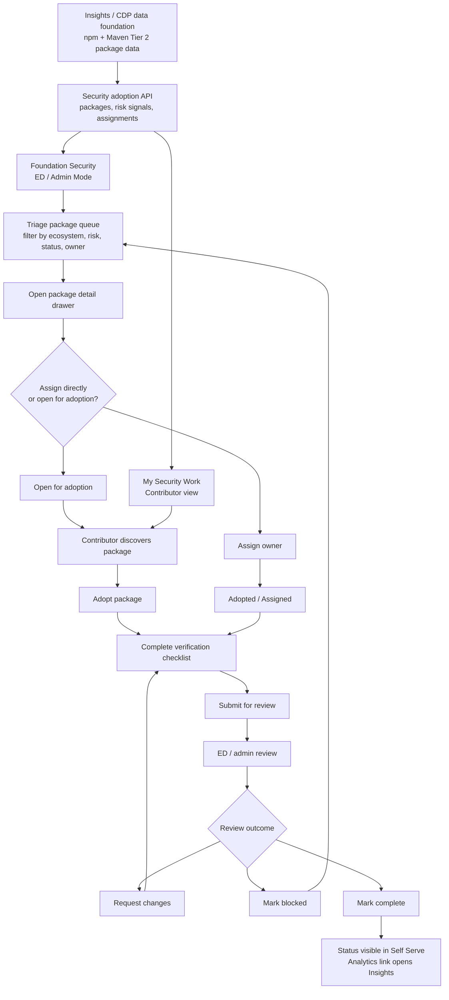
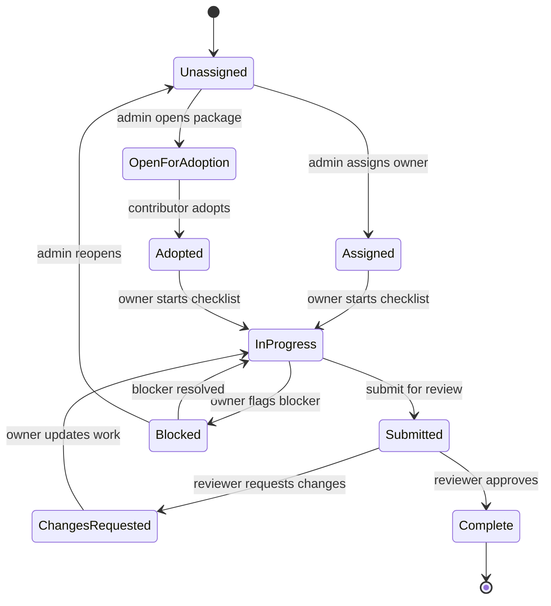

# Self Serve Security Project Adoption

## Context

The Osprey / Tier 2 npm + Maven work needs a Self Serve coordination layer. The
Slack direction was to build a tool that lets people "adopt a project" so the
review and hardening work can be split across a large set of dependencies.

Insights and CDP should remain the source-data and analytics layer. Self Serve
should own authentication, permissions, assignment, coordination, contributor
workflow, and review status.

## Product Surface

### Entry Points

- **Me lens:** `My Security Work`
  - Shows packages/projects I adopted, assigned work, due items, blocked items,
    and review status.
- **Foundation lens / Admin Mode:** `Security`
  - ED/admin coordination dashboard for the selected foundation or LF-wide
    Osprey program.
- **Project lens later:** `Security`
  - Package/repo security posture for a selected project once package-to-repo
    mapping confidence is reliable.

## End-to-End Flow



## State Model



## Admin Flow

1. ED/admin opens `Foundation -> Security`.
2. The page shows top metrics:
   - Critical packages
   - Unassigned
   - Adopted
   - Blocked
   - With critical advisory
   - Maintainer unknown / low-confidence repo mapping
3. ED/admin filters the work queue:
   - Ecosystem: npm, Maven
   - Status: unassigned, adopted, in review, complete, blocked
   - Risk: critical advisory, high dependents, single maintainer, stale repo
   - Source confidence: declared, deps.dev, heuristic, manual
4. ED/admin opens a package detail drawer.
5. ED/admin assigns an owner or marks the package open for adoption.
6. ED/admin tracks progress across adopters.
7. ED/admin links back to Insights for analytics-heavy views.

## Contributor Flow

1. User opens `Me -> My Security Work`.
2. User sees available packages to adopt plus assigned/adopted packages.
3. User opens a package drawer with:
   - Package identity
   - Ecosystem
   - Repository mapping
   - Downloads/dependents
   - Advisories
   - Maintainer/contact info
   - Suggested verification tasks
4. User clicks `Adopt`.
5. User completes the checklist:
   - Verify upstream repo
   - Verify maintainer/security contacts
   - Confirm latest version / release activity
   - Flag suspicious/stale metadata
   - Add notes
6. User submits for review.
7. ED/admin reviews, requests changes, or marks complete.

## Design Direction

Use a dense operational layout consistent with existing LFX One dashboards and
tables. This is not a marketing-style page.

### Page Header

- Title: `Security`
- Subtitle: `Coordinate critical package review and adoption across npm and Maven.`
- Primary admin action: `Create assignment`
- Secondary action: `Open in Insights`

### Stats Band

Use compact metric tiles via the existing stat-card patterns. Use neutral gray,
blue, amber, red, and emerald accents.

### Workspace

Filter row:

- Search input
- Ecosystem select
- Status tabs
- Risk filter
- Assignment filter

Main table columns:

- Package
- Ecosystem
- Criticality
- Downloads
- Dependents
- Repo
- Advisory
- Owner
- Status
- Updated

Row click opens a detail drawer.

### Package Drawer

Tabs:

- `Overview`
- `Adoption`
- `Security`
- `Provenance`
- `Activity`
- `Notes`

Sticky footer actions:

- `Adopt`
- `Assign`
- `Submit review`
- `Mark blocked`
- `Open in Insights`

## Screen Designs

These designs map directly to existing Self Serve structure: left lens rail,
280px navigation panel, content inside the `MainLayoutComponent` outlet, compact
operational spacing, `lfx-table`, `lfx-stat-card-grid`, `lfx-filter-pills`,
`lfx-tag`, `lfx-button`, and drawer-based details.

### Foundation Security Dashboard

Purpose: ED/admin command center for the Osprey package queue.

```text
+------------------------------------------------------------------------------+
| Security                                      [Create assignment] [Insights] |
| Coordinate critical package review and adoption across npm and Maven.        |
+------------------------------------------------------------------------------+
| [ Critical packages 600k ] [ Unassigned 418k ] [ Adopted 12k ] [ Blocked 93 ] |
| [ Critical advisory 1.8k ] [ Low-confidence repo 74k ]                       |
+------------------------------------------------------------------------------+
| [All] [Unassigned] [Open] [Adopted] [In review] [Blocked] [Complete]         |
|                                                                              |
| Search packages...     Ecosystem: All     Risk: All     Owner: All           |
+------------------------------------------------------------------------------+
| Package            Ecosystem  Criticality  Downloads  Dependents  Repo  ... |
| lodash             npm        98.7         52.1M      142k        High      |
| org.slf4j:slf4j    Maven      96.1         --         81k         Medium    |
| express            npm        95.4         31.4M      72k         High      |
+------------------------------------------------------------------------------+
```

Design notes:

- Header is a compact page header, not a hero.
- Primary action appears only for users who can assign or create work.
- `Open in Insights` is secondary because analytics stays in Insights.
- Metrics are scan-first and should use understated status color:
  - critical advisory: red
  - blocked: amber
  - complete/adopted: emerald
  - neutral totals: gray/blue
- Table is the primary surface. No card-per-package view for desktop.

### My Security Work

Purpose: contributor workspace for adopted and available work.

```text
+------------------------------------------------------------------------------+
| My Security Work                                                            |
| Review critical packages you adopted or were assigned.                       |
+------------------------------------------------------------------------------+
| [ Assigned to me 18 ] [ Due soon 4 ] [ In review 3 ] [ Blocked 1 ]          |
+------------------------------------------------------------------------------+
| [My work] [Available to adopt] [Completed]                                  |
|                                                                              |
| Search packages...     Ecosystem: All     Risk: High impact                 |
+------------------------------------------------------------------------------+
| Package         Status        Checklist       Risk signal        Updated     |
| react           In progress   3 / 6           High dependents    Today       |
| minimist        Blocked       2 / 6           Critical advisory  Yesterday   |
| jackson-core    Available     --              Low maintainer     May 25      |
+------------------------------------------------------------------------------+
```

Design notes:

- This route is task-first and should not require a foundation selector.
- Available packages should rank by criticality and readiness for adoption.
- Contributor actions are limited to `Adopt`, `Update checklist`,
  `Submit review`, and `Mark blocked`.

### Package Detail Drawer

Purpose: one place to inspect package data and act without leaving the queue.

```text
+----------------------------------------------+
| lodash                              [Close]  |
| pkg:npm/lodash     npm     Criticality 98.7  |
+----------------------------------------------+
| [Overview] [Adoption] [Security] [Provenance]|
| [Activity] [Notes]                           |
+----------------------------------------------+
| Overview                                     |
| Downloads last month        52.1M            |
| Dependent packages          142k             |
| Dependent repos             39k              |
| Latest version              4.17.21          |
| Latest release              2021-02-20       |
|                                              |
| Repository                                   |
| github.com/lodash/lodash                     |
| Source: deps.dev + declared URL              |
| Confidence: High                             |
+----------------------------------------------+
| [Adopt] [Assign] [Mark blocked] [Insights]  |
+----------------------------------------------+
```

Drawer tab content:

- `Overview`: identity, purl, ecosystem, namespace/name, registry URL,
  criticality score, downloads, dependents, latest release, repo summary.
- `Adoption`: current owner, status, checklist progress, reviewer, due date,
  assignment history.
- `Security`: OSV/GHSA advisories, critical vulnerability flag, security
  contact links, vulnerability policy links.
- `Provenance`: declared repository URL, normalized repository URL, mapping
  source, confidence, monorepo notes, manual override state.
- `Activity`: repo stars, last commit, OpenSSF Scorecard, release cadence,
  maintainer responsiveness when available.
- `Notes`: reviewer notes, contributor notes, blocked reason, audit trail.

### Admin Review Drawer State

Purpose: review a submitted adoption without navigating away from the queue.

```text
+----------------------------------------------+
| Review submission                            |
| express               Submitted by A. User   |
+----------------------------------------------+
| Checklist                                    |
| [x] Upstream repo verified                   |
| [x] Maintainer/security contacts checked     |
| [x] Latest release confirmed                 |
| [x] Advisory data reviewed                   |
| [!] Repo mapping confidence is medium        |
|                                              |
| Contributor notes                            |
| The declared repository redirects to GitHub. |
| deps.dev maps to the same canonical repo.    |
+----------------------------------------------+
| [Request changes] [Mark blocked] [Approve]  |
+----------------------------------------------+
```

Design notes:

- Review actions should be explicit and mutually clear.
- `Approve` moves the item to `Complete`.
- `Request changes` requires a note.
- `Mark blocked` requires a reason and optional owner reassignment.

## Responsive Behavior

- Desktop: table remains primary, filters in a single horizontal row where
  space allows, drawer opens from the right.
- Tablet: filters wrap to two rows; table remains horizontal with the existing
  `lfx-table` behavior.
- Mobile: metrics become a two-column grid; filters stack; table rows should
  collapse into compact rows with package name, ecosystem, status, and primary
  risk signal visible before opening the drawer.

## Visual System

- Use existing Tailwind/LFX tokens only; no hard-coded brand hex values.
- Prefer Font Awesome icons already used in the app:
  - `fa-shield` for Security
  - `fa-box` or `fa-cube` for Package
  - `fa-triangle-exclamation` for Risk / advisory
  - `fa-user-check` for Adopted
  - `fa-clock` for In review / due soon
  - `fa-ban` for Blocked
  - `fa-arrow-up-right-from-square` for Insights
- Tags:
  - `Unassigned`: neutral
  - `Open`: info
  - `Adopted`: info
  - `In progress`: warning
  - `In review`: warning
  - `Blocked`: danger
  - `Complete`: success
- Keep cards at the existing 8px radius or less.
- Do not put UI cards inside other cards; repeated package rows belong in a
  table, not nested cards.

## Empty, Loading, and Error States

- No foundation selected:
  - Title: `Select a foundation to view security work`
  - Body: `Use the foundation selector in the sidebar to choose a foundation.`
- Empty queue:
  - Title: `No packages match these filters`
  - Body: `Clear filters or switch to all statuses.`
- No assigned work:
  - Title: `No security work assigned`
  - Body: `Open available packages to adopt a package when work is ready.`
- Error:
  - Title: `Failed to load security work`
  - CTA: `Retry`
- Loading:
  - Use existing table skeleton behavior with six to ten rows.

## Accessibility

- Status must not rely on color alone; every status appears as text in a tag.
- Package rows are keyboard reachable and open the drawer with Enter/Space.
- Drawer tabs use tablist semantics and preserve focus when switching tabs.
- Drawer close returns focus to the triggering table row.
- Review actions that require notes should focus the note field after selection.

## Codebase Fit

Relevant existing patterns:

- `apps/lfx-one/src/app/app.routes.ts` for flat routes under
  `MainLayoutComponent`.
- `apps/lfx-one/src/app/layouts/main-layout/main-layout.component.ts` for
  lens-aware sidebar entries.
- `apps/lfx-one/src/app/modules/dashboards/foundation-projects/` for dense
  operational table + filters + stats.
- `apps/lfx-one/src/app/modules/newsletters/` for list/create/detail patterns
  and ED-only feature routing.
- `apps/lfx-one/src/app/shared/components/table/`,
  `stat-card-grid/`, `filter-pills/`, `empty-state/`, `tag/`, and `button/`.

Suggested module:

```text
apps/lfx-one/src/app/modules/security/
|-- security.routes.ts
|-- security-work-dashboard/
|-- security-admin-dashboard/
|-- package-detail-drawer/
`-- components/
```

Suggested routes:

- `/security` with `data: { lens: 'me' }`
- `/foundation/security` with `data: { lens: 'foundation' }`, ED/admin gated
- `/project/security` later, once package-to-repo confidence is ready for
  project context

## Backend/API Contract

Do not build the frontend against mock data. Minimum real API surface:

- `GET /api/security/packages`
  - filters, cursor pagination, sort
- `GET /api/security/packages/:id`
- `POST /api/security/packages/:id/adoptions`
- `PATCH /api/security/adoptions/:id`
- `POST /api/security/adoptions/:id/submit`
- `POST /api/security/adoptions/:id/review`
- `GET /api/security/my-work`
- `GET /api/security/summary`

Shared interfaces should live in:

```text
packages/shared/src/interfaces/security-adoption.interface.ts
```

## Suggested PR Sequence

1. Shared types + backend proxy/controller/service once upstream API contract is
   confirmed.
2. Admin package queue page with filters/table/drawer in read-only mode.
3. Adoption actions and `My Security Work`.
4. Review workflow, notes, blocked states, audit trail.
5. Project-lens package security view after package-to-repo confidence is high
   enough.

## Open Decisions

- Which upstream service owns the security adoption API: new Osprey/security
  service, Insights API, or an existing LFX service?
- Should this be LF-wide first or foundation-scoped first?
- What roles can assign/review adoption work beyond ED/admin?
- What fields should count as completion for npm vs Maven?
- Should Mythos be surfaced directly in the drawer or only linked out?
- How much of this is one-time Osprey workflow versus permanent Self Serve
  security surface?
